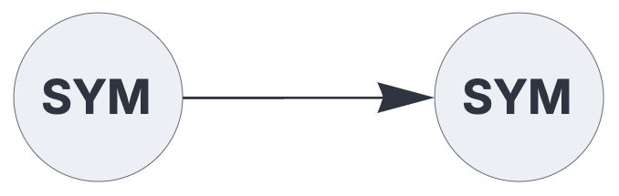

CREATING INTELLIGENCE

# Documentation


This is a software framework for cognitive computing, based on hyperdimensional sparse representations.

It is used for modeling and simulating spiking neural networks that transmit sparse discrete codes between instances of Topological Associative Memory. In this framework, mathematical sets are the fundamental datatype, representing either Sparse Distributed Representations (SDRs) or Sparse Holographic Representations (SHRs).


## Circuit dataflow description


Circuits configurations are specified by a either a JSON string or the equivalent Python dictionary:


```json
{ "hyperparameters": {"default": [1000, 10]},
  "dataflow": [
	{"component": "input", "plugin": "codec", "send": [1]},
	{"component": "output", "plugin": "codec", "receive": [1]}
  ]}
```

<br>

The above configuration rendered as schematics:

<br>


## Python Circuit frontend

The  `Circuit` factory function compiles a circuit configuration (dictionary or  JSON string) and returns a dispatch dictionary. This output includes a `function` property, representing the set-processing function defined by the circuit.  

The circuit `function` takes one argument per input component, and returns a tuple consisting of one element per output component.

The default type of input and output blocks is mathematical sets or multisets. Excitatory
signals are represented as positive integers, while their negative counterparts represent
inhibitory signals. Optional input encoders and output decoders convert between external datatypes and the internal set-based representations.


**Code**
```python
from creating_intelligence import Circuit

config = {
    'hyperparameters': {'default': [1000, 10]},
    'dataflow': [
        {'component': 'input', 'plugin': 'codec', 'send': [1]},
        {'component': 'output','plugin': 'codec', 'receive': [1]}
    ]
}

circ = Circuit(config)

print(circ["function"]("Hello, World!"))
```

**Output**

```text
('Hello, World!',)
```

The compiled circuit is represented by a dispatch dictionary:

**Code**
```python
from pprint import pprint
pprint(circ)
```

**Output**
```python
{'clear': <function Circuit.<locals>.clear at 0x10a0b9640>,
 'function': <function Circuit.<locals>.f at 0x10a0b94e0>,
 'nodes': <function Circuit.<locals>.<lambda> at 0x10a0b96f0>,
 'receive_blocks': [[1000, 10]],
 'schematics': <function Circuit.<locals>.schematics at 0x10a0b9590>,
 'send_blocks': [[1000, 10]]}
```

Properties of the output dictionary:

| Property  | Description |
|:------------|:------------------------------------------------|
| `function`      |   the circuit's  function interface  |
| `clear` |  circuit destructor function |
| `receive_blocks` |  list of hyperparameters [N,P] per input component  |
| `send_blocks` |  list of hyperparameters [N,P] per output component  |
| `nodes` |  internal configuration details  |
| `schematics` |   circuit schematics as PNG file  |


## Python Memory backend

Like the `Circuit` frontend, a  `Memory` backend  is constructed via a factory function.
While this mechanism is usually encapsulated within the circuit's memory components,
a standalone Topological Associative Memory instance can be directly created as follows:

**Code**
```python
from creating_intelligence import Memory
config = { "A_parameters": [1000, 10],"B_parameters": [1000, 10]}
mem = Memory(config)

from pprint import pprint
pprint(mem)
```

**Output**
```python
{'A_parameters': (1000, 10),
 'B_parameters': (1000, 10),
 'T': 7,
 'backend': 'c_ffi',
 'clear': <function Memory.<locals>.clear at 0x10d7fcd50>,
 'memorycount': <function Memory.<locals>.memorycount at 0x109b95380>,
 'retrieve': <function Memory.<locals>.retrieve at 0x109a65c70>,
 'store': <function Memory.<locals>.store at 0x109a65d20>}
```

Properties of the output dictionary:

| Property  | Description |
|:------------|:------------------------------------------------|
| `A_parameters`      |   input layer hyperparameters [N,P]  |
| `B_parameters` |  output layer parameters  |
| `T` |  retrieval pattern matching threshold   |
| `store` |  write to memory  |
| `retrieve` | read from memory  |
| `memorycount` |   memory usage (bits)  |
| `backend` |   backend version identifier  |
| `clear` |   destructor function  |

This framework includes multiple, functionally equivalent implementations of the 
Topological Associative Memory algorithm  By default, a performance-optimized  version
implement in Standard C is used. Switch to a native Python 
 backend  by setting this environment variable:

 ```python
 MEMORY_BACKEND="python"
 ```

The same mechanism allows custom backend versions to be plugged into the framework.

 

