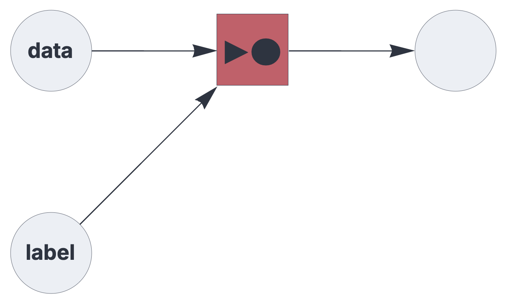

CIRCUIT COMPONENTS

# associator

<br>

Hetero-associative memory component for supervised learning.

See also: https://creatingintelligence.org/#supervised-learning


## Details and properties

- Wrapper for a hetero-associative topological memory instance.
- Receives the label from its first `receive` block and data from the remaining blocks.
- Training is triggered if the label input is non-empty.
- Inference is triggered by an empty label input.
- Sends the inferred label.
- Resolves multiset and inibitory input prior to processing.


<br>

 
| Property        | Default | Description |
|:------------|:-----:|:----------------------------------------|
| `send`        |  *required*    |  integer, representing a single output slot |
| `receive`     |  *required*    |  two or more input slots with pathway tags |
| `threshold`     | *automatic*    |  relative pattern matching threshold  |
| `decimate`      | 1    | proportional stochastic decimation applied to training data |

<br>

Use standard [style options](components.md) to customize the component's appearance in circuit schematics.


## Supervised learning


A basic supervised learning setup using hetero-associative memory:

```json
{ "hyperparameters": {"default": [1000, 10]},
  "dataflow": [
	{"component": "input", "send": [1], "label": "label"},
	{"component": "input", "send": [2], "label": "data"},
	{"component": "associator", "send": [11], "receive": [1, 2]},
	{"component": "output", "receive": [11]}
  ]}
```

<br>


## Source code

*from circuits.py insert associator*
