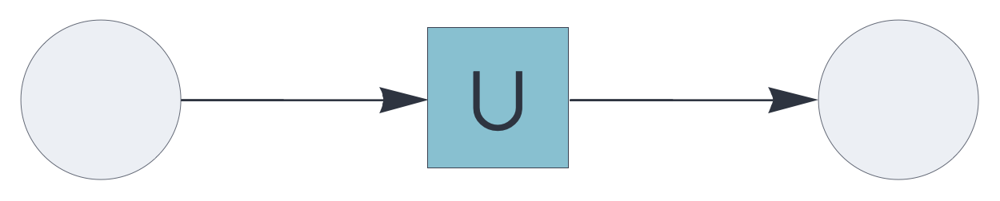
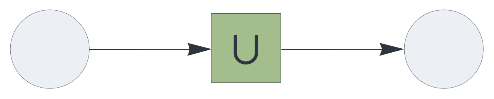

UPDATE RULE PLUGINS

# augmentation

<br>

Update rule plugin, computing the multiset aggregation of signals.

See also: https://creatingintelligence.org/#update-rules


## Details

- Plugin for [`auto`](auto.md), [`delay`](delay.md), and [`temporal`](temporal.md) components.
- Computes the multiset aggregation of its inputs.
- Corresponds to the set union after deduplication.

## Auto-associative memory with augmentation update

As a plugin for the [`auto`](auto.md) component, `augmentation` 
aggregates the memory's state with the retrieved value, then
deduplicating the multiset to give its underlying set of unique elements.

The `augmentation` rule completes the input while retaining non-matching elements. Used iteratively in conjunction with stochastic subsampling, this mechanism converges incrementally to a stable state.


```json
{ "hyperparameters": {"default": [1000, 10]},
  "dataflow": [
	{"component": "input", "send": [1]},
	{"component": "auto", "plugin": "augmentation", 
		"send": [2], "receive": [1]},
	{"component": "output", "receive": [2]}
  ]}
```

<br>


See also: https://creatingintelligence.org/#auto-associative-memory

## Delay component with temporal state augmentation 


The [`delay`](delay.md) component uses the `augmentation` mechanism for
temporal signal integration.

```json
{ "hyperparameters": {"default": [1000, 10]},
  "dataflow": [
	{"component": "input", "send": [1]},
	{"component": "delay", "plugin": "augmentation", 
		"send": [11], "receive": [1], "capacity": 2, "decay": 0.15},
	{"component": "output", "receive": [11]}
  ]}
```

<br>


## Temporal associative memory with state augmentation

Used as a plugin for the [`temporal`](temporal.md) component, `augmentation` 
aggregates an orderless state representing prior inputs.


```json
{ "hyperparameters": {"default": [1000, 10]},
  "dataflow": [
	{"component": "input", "send": [1]},
	{"component": "temporal", "plugin": "augmentation", 
		"send": [11], "receive": [1], "capacity": 5},
	{"component": "output", "receive": [11]}
  ]}
```

<br>


## Source code

*from circuits.py insert augmentation*

