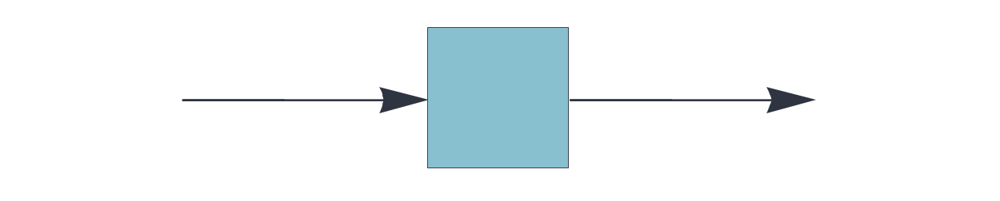
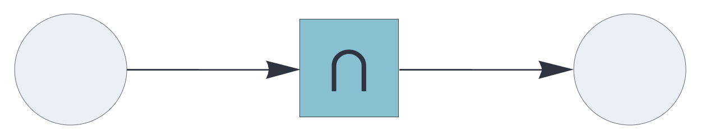

CIRCUIT COMPONENTS

# auto

<br>

Auto-associative topological memory component, storing items and hypergraphs.


See also: https://creatingintelligence.org/#auto-associative-memory


## Details and properties

- Incrementally learns auto-associations at every execution cycle.
- Uses update rule plugins to control the mechanics of state updates.
- Controls sparsity through stochastic subsampling mechanisms.  
- Deduplicates incoming multisets and inhibitory signals, internally processing the
underlying set of unique elements.
- Supports multiple data blocks, joined internally as the memory's shared input/output layer. The hyperparameters of input and output blocks must be identical.


<br>

 
| Property        | Default | Description |
|:------------|:-----:|:----------------------------------------|
| `send`        |  *required*    |  `[integer,...]` representing one or more output slots |
| `receive`     |  *required*    |  same as `send`, with optional pathway tags |
| `plugin`	    | `replacement` | auto-associative update rule |  
| `threshold`     | *automatic*    |  relative auto-associative pattern matching threshold |
| `rate_limit`    | infinite | subsample input if it exceeds the specified relative rate limit |    
| `decimate`      | 1    | proportional stochastic decimation |
| `learn`      | *P*   |  |

<br>

Use standard [style options](components.md) to customize the component's appearance in circuit schematics.


## Auto-associative memory with replacement update

As the default update rule for the [`auto`](auto.md) component, `replacement` 
substitutes the memory's state with the retrieved value.

This is the classic auto-associative setup, most useful for pattern completion, denoising, and item stores. With this configuration, the auto-associative memory converges to a stable state. Stability is normally reached with just a single cycle because denoising iterations are already encapsulated within the memory retrieval algorithm.


```json
{ "hyperparameters": {"default": [1000, 10]},
  "dataflow": [
	{"component": "input", "send": [1]},
	{"component": "auto", "plugin": "replacement", 
		"send": [2], "receive": [1]},
	{"component": "output", "receive": [2]}
  ]}
```

<br>

## Auto-associative memory with residual update

As a plugin for the [`auto`](auto.md) component, the `residual` update rule
removes the retrieved pattern from the query, leaving only the novel elements.
This mechanism is the basis for associative novelty detection.


```json
{ "hyperparameters": {"default": [1000, 10]},
  "dataflow": [
	{"component": "input", "send": [1]},
	{"component": "auto", "plugin": "residual", "send": [2], "receive": [1]},
	{"component": "output", "receive": [2]}
  ]}
```

<br>


## Auto-associative memory with difference update

As a plugin for the [`auto`](auto.md) component, the `difference` update rule
replaces the memory's state with the symmetric difference between the query and the retrieved data, removing the matching elements.

This update rule enables generative behavior in auto-associative memory retrieval.


```json
{ "hyperparameters": {"default": [1000, 10]},
  "dataflow": [
	{"component": "input", "send": [1]},
	{"component": "auto", "plugin": "difference", 
		"send": [2], "receive": [1]},
	{"component": "output", "receive": [2]}
  ]}
```

<br>


## Auto-associative memory with complement update

As a plugin for the [`auto`](auto.md) component, the `complement` update 
removes the retrieved pattern from the query pattern, leaving only the novel elements.


```json
{ "hyperparameters": {"default": [1000, 10]},
  "dataflow": [
	{"component": "input", "send": [1]},
	{"component": "auto", "plugin": "residual", "send": [2], "receive": [1]},
	{"component": "output", "receive": [2]}
  ]}
```

<br>


## Auto-associative memory with augmentation update

As a plugin for the [`auto`](auto.md) component, `augmentation` 
aggregates the memory's state with the retrieved value, then
deduplicating the multiset to give its underlying set of unique elements.

The `augmentation` rule completes the input while retaining non-matching elements. Used iteratively in conjunction with stochastic subsampling, this mechanism converges incrementally to a stable state.


```json
{ "hyperparameters": {"default": [1000, 10]},
  "dataflow": [
	{"component": "input", "send": [1]},
	{"component": "auto", "plugin": "augmentation", 
		"send": [2], "receive": [1]},
	{"component": "output", "receive": [2]}
  ]}
```

<br>


## Auto-associative memory with coincidence update

As a plugin for the [`auto`](auto.md) component, the `coincidence` update rule
retaining the matching elements between the query and the retrieved pattern.

```json
{ "hyperparameters": {"default": [1000, 10]},
  "dataflow": [
	{"component": "input", "send": [1]},
	{"component": "auto", "plugin": "coincidence", 
		"send": [2], "receive": [1]},
	{"component": "output", "receive": [2]}
  ]}
```

<br>


## Source code

*from circuits.py insert auto*
