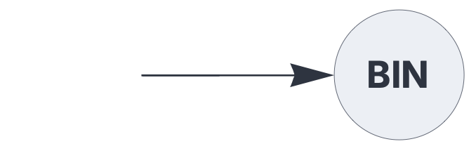
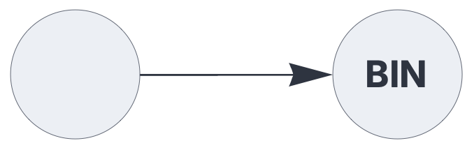

ENCODERS & DECODERS

# binning

<br>

Decoder plugin, clustering similar Sparse Distributed Representations (SDRs).

See also: https://creatingintelligence.org/#sparse-distributed-representations

## Details

- Decoder plugin for the [`output`](output.md) component.
- Clusters similar SDRs into a variable number of bins.
- Uses the auto-associative pattern matching threshold to determine similarity.
- Assigns and returns bin numbers 1,2,...
- Maintains a globally shared mapping for each hyperparameter combination [N, P].


## Clustering SDRs

The following circuit classifies SDRs, returning bin numbers 1,2,...


```json
{ "hyperparameters": {"default": [1000, 10]},
  "dataflow": [
	{"component": "input", "send": [1]},
	{"component": "output", "plugin": "binning", "receive": [1]}
  ]}
```

<br>

