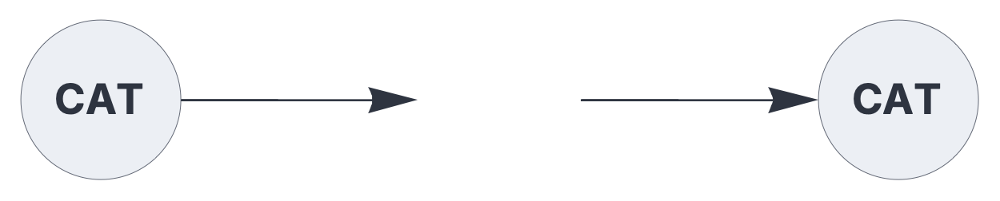
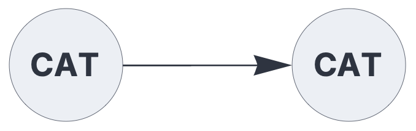

ENCODERS & DECODERS

# category

<br>

Encoder/decoder for a fixed number of categories.

See also: https://creatingintelligence.org/#sparse-holographic-representations

## Details and properties

- Typically used for supervised learning.
- Similar to [`codec`](#codec.md), but generates non-overlapping encodings.
- Encoder plugin for the [`input`](input.md) component.
- Decoder plugin for the [`output`](output.md) component.
- Encodes integers 0 to K-1 as non-overlapping SHRs.
- The default number of categories is taken to be the ratio of hyperparameters N/P.
- If an explicit number K of categories is specified, the SHR population is set to N/K.
- Mappings with identical parameters [N, P, K] are globally shared, enabling encode-decode roundtrips. 

<br>

 
| Property        | Default | Description |
|:------------|:-----:|:----------------------------------------|
| `categories`        |  floor(N/P)   |  number of categories |


## Encoding and decoding chain for categories

The following circuit encodes integers 0 to 19 as non-overlapping SHRs with population 50,
and subsequently decodes the internal representation, mirroring the input. 


```json
{ "hyperparameters": {"default": [1000, 10]},
  "dataflow": [
	{"component": "input", "plugin": "category", 
		"send": [1], "categories": 20},
	{"component": "output", "plugin": "category", 
		"receive": [1], "categories": 20}
  ]}
```

<br>


## Source code

*from circuits.py insert category*

