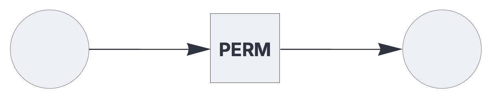
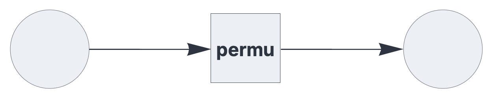

CIRCUIT COMPONENTS


# circuit

<br>

A component that embeds an entire circuit.

See also: https://creatingintelligence.org/#circuits


## Details and properties

- Circuits can be nested to any depth, provided the nesting is acyclic.
- Uses the `shared` plugin for embedding a shared circuit.
- Uses the `file` plugin to create a local embedded circuit.
- Exchanges sets or multisets with the embedded circuit.
- The embedded circuit may use [`input`](#input.md) or [`output`](output.md) plugins to preprocess or postprocess the exchanged data.

<br>

 
| Property    | Default | Description |
|:------------|:---------:|:---------------------------------------|
| `send`      |  *required* |  output slots, as a list of integers |
| `receive`   |  *required* | input slots with optional pathway tags |
| `plugin`	  |  `shared` |   extension module |  
| `name`	  |  *required* |   registry identifier / filename |  


## Shared embedded circuits 

An instantiated circuit can be shared to and embedded by other circuits
by registering it via a `name` option:

```json
{ "options": {"name": "PERM"},
  "hyperparameters": {"default": [1000, 10]},
  "dataflow": [
	{"component": "input", "send": [1]},
	{"component": "output", "receive": [{"slot": 1, "tags": ["permute"]}]}
  ]}
```

<br>


The following circuit embeds the above instance by referring to its
registry name. The same shared instance can be embedded by multiple `circuit`
components.


```json
{ "hyperparameters": {"default": [1000, 10]},
  "dataflow": [
	{"component": "input", "send": [1]},
	{"component": "circuit", "plugin": "shared", "send": [11], 
		"receive": [1], "name": "PERM"},
	{"component": "output", "receive": [11]}
  ]}

```


<br>

The hyperparameters of shared embedded circuits must
match the parameters of its inbound and outbound slots.


## Local embedded circuits

Using the `file` plugin, the `circuit` component imports a JSON circuit 
description and embeds a local instance:


```json
{ "hyperparameters": {"default": [1000, 10]},
  "dataflow": [
	{"component": "input", "send": [1]},
	{"component": "circuit", "plugin": "file", "send": [11], 
		"receive": [1], "name": "permutation.json"},
	{"component": "output", "receive": [11]}
  ]}
```

<br>

If the embedded circuit specifies a registry name, it can be shared 
across multiple `circuit` components.

The hyperparameters of local embedded circuits are automatically rescaled to
match the parameters of its inbound and outbound slots.


