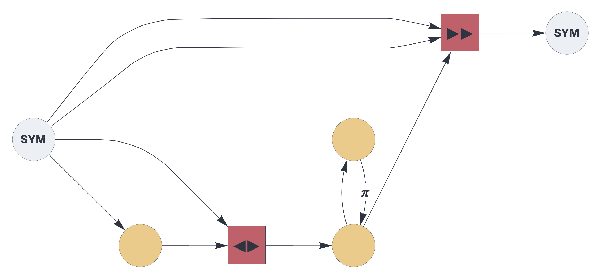

CIRCUIT CONFIGURATON


# Circuits

Within this framework, circuits represent networks of Topological Associative Memory instances encapsulated in circuit components and connected through pathways.

See also: https://creatingintelligence.org/#circuits


## Circuit configuration

Circuits are specified by a JSON string or the equivalent Python dictionary:


```json
{ "options": {"name": "Reservoir"},
  "hyperparameters": {"default": [2000, 8], "61": [2000, 8]},
  "dataflow": [
	{"component": "input", "plugin": "codec", "send": [11]},
	{"component": "delay", "send": [21], "receive": [11]},
	{"component": "heteroencoder", "send": [51], "receive": [11, 21]},
	{"component": "delay", "send": [61], 
			"receive": [[51, {"slot": 62, "tags": ["permute"]}]]},
	{"component": "delay", "send": [62], 
			"receive": [61], "rate_limit": 3.0},
	{"component": "predictor", "send": [101], "receive": [11, [11, 61]]},
	{"component": "output", "plugin": "codec", "receive": [101]}
  ]}
```


The above configuration rendered as circuit schematics:

<br>


## Details and properties


- Circuits are composed of stateful [components](components.md) connected through stateless [pathways](pathways.md).
- Dataflow is synchronized, governed by a global clock.
- At every time step, components process their current input and pass it into the output buffer.
- A circuit must include at least one input and one output component.
- Circuits can be  [nested](circuit.md).


<br>

 
| Property    | Description |
|:------------|:----------------------------------------|
| `$schema`      |   link to JSON schema |
| `options`   |   global circuit options |
| `hyperparameters`	  |   pathway dimensions and populations |  
| `dataflow`     |  nodes and edges of the circuit graph | 

<br>


#### options 
| Property  | Description |
|:------------|:------------------------------------------------|
| `name`      |   the circuit's registry identifier, used for embedding circuits |
| `multiplex` |  temporal gating pattern, given as a list of 0s or 1s (optional) |


#### hyperparameters
| Property | Description |
|:------------|:------------------------------------------------|
| `default` |   default slot dimension and population [N, P] |
| `integer`   |   a specific slot's dimension and population [N, P] |


#### dataflow
|  Property  | Description |
|:------------|:------------------------------------------------|
| `component`      |   the component's factory function name |
| `plugin`   |   plugin factor function name (optional) |
| `send`   |   output slots, given as a list of integers |
| `receive`   |   list of input slots or tagged pathways  |


