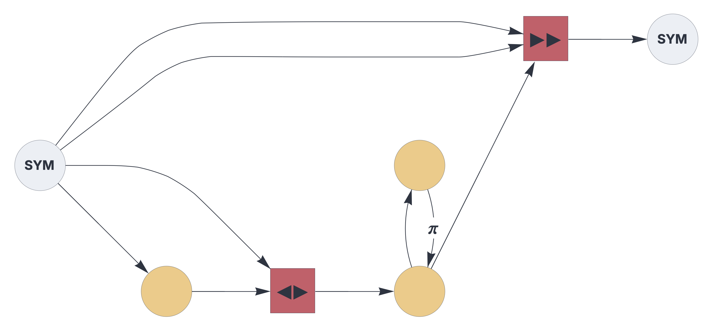

CIRCUIT CONFIGURATION


# Circuits

Within this framework, circuits represent networks of Topological Associative Memory instances encapsulated in circuit components and connected through pathways.

See also: https://creatingintelligence.org/#circuits


## Circuit configuration

Circuits are specified by a JSON string or the equivalent Python dictionary:


```json
{  "$schema": "https://creatingintelligence.org/schemas/circuit-v1.json",
   "options": {"name": "Reservoir"},
  "hyperparameters": {"default": [2000, 8], "61": [2000, 8]},
  "dataflow": [
	{"component": "input", "plugin": "codec", "send": [11]},
	{"component": "delay", "send": [21], "receive": [11]},
	{"component": "heteroencoder", "send": [51], "receive": [11, 21]},
	{"component": "delay", "send": [61], 
			"receive": [[51, {"slot": 62, "tags": ["permute"]}]]},
	{"component": "delay", "send": [62], 
			"receive": [61], "rate_limit": 3.0},
	{"component": "predictor", "send": [101], "receive": [11, [11, 61]]},
	{"component": "output", "plugin": "codec", "receive": [101]}
  ]}
```


The above configuration rendered as circuit schematics:

<br>


## Details and properties


- Circuits are composed of stateful [components](components.md) connected through stateless [pathways](pathways.md).
- Dataflow is synchronized, governed by a global clock.
- A latched circuit advances its clock only on cycles with input (see [Latched circuits](#latched-circuits)).
- At every time step, components process their current input and pass it into the output buffer.
- A circuit must include at least one input and one output component.
- Circuits can be  [nested](circuit.md).


<br>

 
| Property    | Description |
|:------------|:----------------------------------------|
| `$schema`      |   link to JSON schema |
| `options`   |   global circuit options |
| `hyperparameters`	  |   pathway dimensions and populations |  
| `dataflow`     |  nodes and edges of the circuit graph | 

<br>


#### options 
| Property  | Description |
|:------------|:------------------------------------------------|
| `name`      |   the circuit's registry identifier, used for embedding circuits |
| `multiplex` |  temporal gating pattern, given as a list of 0s or 1s (optional) |
| `latch` |  skip cycles in which all inputs are empty (optional, default false) |


#### hyperparameters
| Property | Description |
|:------------|:------------------------------------------------|
| `default` |   default slot dimension and population [N, P] |
| `integer`   |   a specific slot's dimension and population [N, P] |


#### dataflow
|  Property  | Description |
|:------------|:------------------------------------------------|
| `component`      |   the component's factory function name |
| `plugin`   |   plugin factory function name (optional) |
| `send`   |   output slots, given as a list of integers |
| `receive`   |   list of input slots or tagged pathways  |


## Latched circuits

With the `latch` option, a circuit skips every cycle in which all of its input
blocks are empty (after input encoding). Nothing is evaluated, the output blocks
are empty, and the circuit's clock does not advance: delays, pathway gating and
the `multiplex` sequence only progress on cycles with input. Inside a latched
circuit, a sparse input stream therefore has no gaps.

The option applies equally to a main circuit and to an [embedded circuit](circuit.md),
where the embedded circuit's own `options` decide.

**Code**

```python
from creating_intelligence import Circuit

config = {
    "options": {"latch": True},
    "hyperparameters": {"default": [1000, 10]},
    "dataflow": [
        {"component": "input", "plugin": "codec", "send": [1]},
        {"component": "delay", "send": [2], "receive": [1]},
        {"component": "delay", "send": [3], "receive": [2]},
        {"component": "output", "plugin": "codec", "receive": [2]},
        {"component": "output", "plugin": "codec", "receive": [3]}
    ]
}
circ = Circuit(config)
for token in ["a", [], "b", [], [], "c", "d"]:
    print(circ["function"](token))
```

**Output**

```text
('a', None)
(None, None)
('b', 'a')
(None, None)
(None, None)
('c', 'b')
('d', 'c')
```

The second output always holds the previous token, regardless of the gaps
between tokens. Without `latch`, the gaps travel down the delay chain:

```text
('a', None)
(None, 'a')
('b', None)
(None, 'b')
(None, None)
('c', None)
('d', 'c')
```

A latched circuit cannot run on internal feedback alone: a circuit that
generates output from empty input (for example, a recurrent loop driven by its
own feedback) must not be latched.
