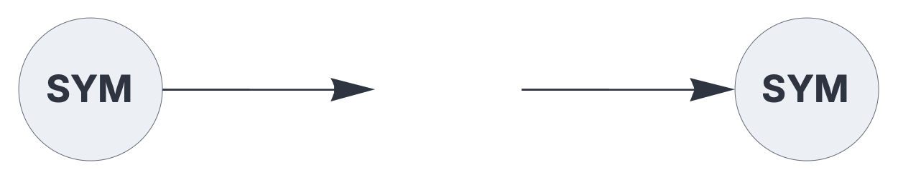

ENCODERS & DECODERS

# codec

<br>

General-purpose encoder/decoder for symbolic tokens. 

See also: https://creatingintelligence.org/#sparse-holographic-representations

## Details

- Dynamically creates a lexicon that maps tokens to Sparse Holographic Representations (SHRs).
- Encoder plugin for the [`input`](input.md) component.
- Decoder plugin for the [`output`](output.md) component.
- Encodes string tokens as well as general data structures.
- Creates a random SHR for each unique token.
- Decoding is based on the auto-associative pattern matching threshold.
- Maintains a globally shared lexicon for each hyperparameter combination [N, P].


<br>

Use standard [style options](components.md) to customize the plugin's appearance in circuit schematics.


## Encoding and decoding chain for symbolic tokens

The following circuit encodes a token to an SHR and subsequently decodes it, 
mirroring the input.


```json
{ "hyperparameters": {"default": [1000, 10]},
  "dataflow": [
	{"component": "input", "plugin": "codec", "send": [1]},
	{"component": "output", "plugin": "codec", "receive": [1]}
  ]}
```

<br>


## Source code

*from circuits.py insert codec*

