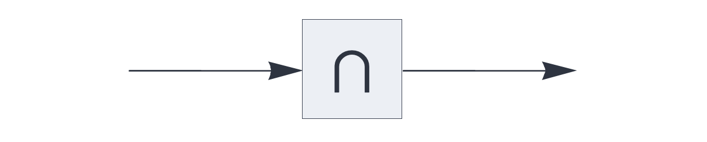

UPDATE RULE PLUGINS

# coincidence

<br>

Update rule plugin for auto-associative memory, retaining the matching elements
between the query and the retrieved pattern.


See also: https://creatingintelligence.org/#update-rules


## Details

- Plugin for the [`auto`](auto.md) component.
- Not applicable for temporal integration ([`delay`](delay.md) and  	[`temporal`](temporal.md)).
- Transparently handles multisets and inhibitory signals.
- Corresponds to the set intersection after deduplication.


## Auto-associative memory with coincidence update

As a plugin for the [`auto`](auto.md) component, the `coincidence` update rule
retains only the matching elements, without completing the pattern.


```json
{ "hyperparameters": {"default": [1000, 10]},
  "dataflow": [
	{"component": "input", "send": [1]},
	{"component": "auto", "plugin": "coincidence", 
		"send": [2], "receive": [1]},
	{"component": "output", "receive": [2]}
  ]}
```

<br>


See also: https://creatingintelligence.org/#auto-associative-memory

