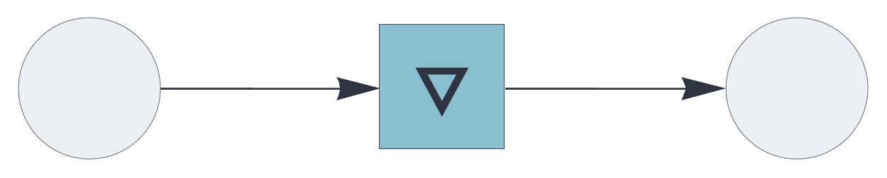
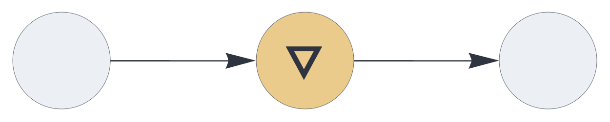
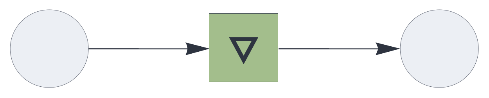

UPDATE RULE PLUGINS

# complement

<br>

Update rule plugin for auto-associative memory and temporal integration, updating
the state by removing the current signal.

See also: https://creatingintelligence.org/#update-rules


## Details

- Plugin for [`auto`](auto.md), [`delay`](delay.md), and [`temporal`](temporal.md) components.
- Transparently handles multisets and inhibitory signals.
- Corresponds to the set complement after deduplication.


## Auto-associative memory with complement update

As a plugin for the [`auto`](auto.md) component, the `complement` update 
removes the retrieved pattern from the query pattern, leaving only the novel elements.


```json
{ "hyperparameters": {"default": [1000, 10]},
  "dataflow": [
	{"component": "input", "send": [1]},
	{"component": "auto", "plugin": "residual", "send": [2], "receive": [1]},
	{"component": "output", "receive": [2]}
  ]}
```

<br>


See also: https://creatingintelligence.org/#auto-associative-memory


## Delay with complement plugin

```json
{ "hyperparameters": {"default": [1000, 10]},
  "dataflow": [
	{"component": "input", "send": [1]},
	{"component": "delay", "plugin": "complement", 
		"send": [11], "receive": [1], "capacity": 1},
	{"component": "output", "receive": [11]}
  ]}
```
<br>


## Temporal associative memory with complement plugin

```json
{ "hyperparameters": {"default": [1000, 10]},
  "dataflow": [
	{"component": "input", "send": [1]},
	{"component": "temporal", "plugin": "complement", 
		"send": [11], "receive": [1], "capacity": 2},
	{"component": "output", "receive": [11]}
  ]}
```

<br>


