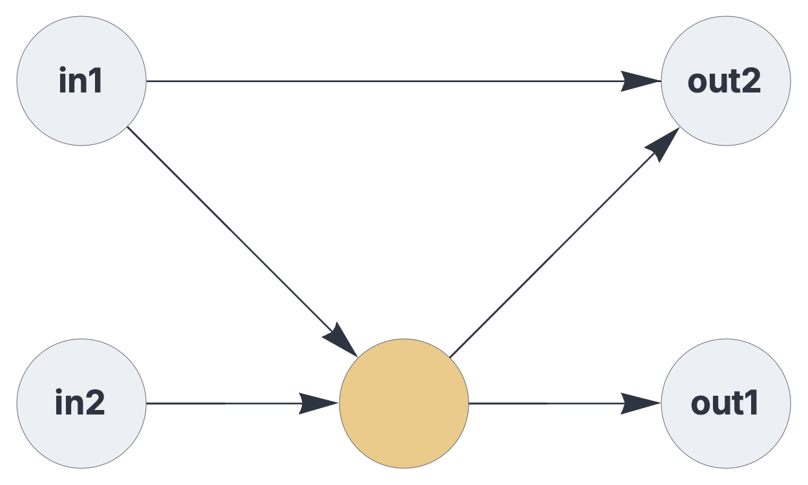
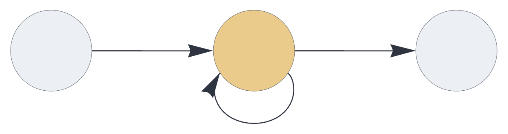
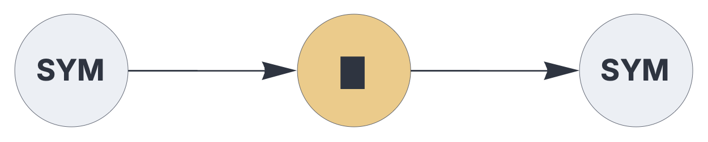
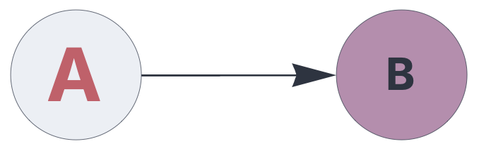

CIRCUIT CONFIGURATON


# Components

<br>


Components are the fundamental building blocks of circuits, representing stateful operations on sparse sets or multisets.

See also: https://creatingintelligence.org/#circuits

## Details and properties

- Data flow components, such as [`delay`](#delay.md), control the temporal integration of data over multiple timesteps.
- Memory components, such as [`auto`](#auto.md) or [`temporal`](#temporal.md), encapsulate a topological associative memory instance.
- Circuit components generally maintain a state across multiple execution cycles, whereas pathways are strictly stateless.
- The functionality of components can be extended via a standardized plugin mechanism.
- This framework supports the seamless integration of user-defined, custom components and plugins.
- Certain components may receive and send multiple signal partitions (block coding).
- Components are visualized as circles (data flow components) or squares (memory components)  in circuit schematics.


<br>

 
| Property    | Description |
|:------------|:----------------------------------------|
| `send`      |   output slots, as a list of integers |
| `receive`   |   list of input slots or tagged pathways |
| `plugin`	  |   extension module |  
| `label`     |   user-defined vertex label in circuit schematics | 
| `shape`	  |   vertex shape ("square", "circle", or "none")
| `fill`      |   background color (palette index 0 to 15)  | 
| `size`      |   font size, given in points |
| `color`     |   font color (palette index 0 to 15) |


## Sending and receiving data

A pathway is defined via a slot number that occurs in one component's `send`
parameters and in another (or the same) component's receive parameter. The choice
of slot numbers is arbitrary. The same slot can be received by multiple components (multi-casting). However, the same slot number must not occur
in multiple `send` parameters. 
 

```json
{ "hyperparameters": {"default": [1000, 10]},
  "dataflow": [
	{"component": "input", "send": [1]},
	{"component": "output", "receive": [1]}
  ]}
```

<br>


Lists of slot numbers denote disjoint blocks. Here the [`delay`](#delay) component
receives and sends two disjoint set partitions:

```json
{ "hyperparameters": {"default": [1000, 10]},
  "dataflow": [
	{"component": "input", "send": [1]},
	{"component": "input", "send": [2]},
	{"component": "delay", "send": [11, 12], "receive": [1, 2]},
	{"component": "output", "receive": [11]},
	{"component": "output", "receive": [12]}
  ]}
```

<br>


`receive` parameters wrapped in a list denotes signal merging:

```json
{ "hyperparameters": {"default": [1000, 10]},
  "dataflow": [
	{"component": "input", "send": [1]},
	{"component": "input", "send": [2]},
	{"component": "delay", "send": [11], "receive": [[1, 2]]},
	{"component": "output", "receive": [11]}
  ]}
```

<br>

A circuit that combines pathway merging and block coding:

```json
{ "hyperparameters": {"default": [1000, 10]},
  "dataflow": [
	{"component": "input", "send": [1], "label": "in1"},
	{"component": "input", "send": [2], "label": "in2"},
	{"component": "delay", "send": [11, 12], "receive": [1, 2]},
	{"component": "output", "receive": [11], "label": "out1"},
	{"component": "output", "receive": [[12, 1]], "label": "out2"}
  ]}
```

<br>


A simple feedback system, routing the component's output slot directly back
into its input:

```json
{ "hyperparameters": {"default": [1000, 10]},
  "dataflow": [
	{"component": "input", "send": [1]},
	{"component": "delay", "send": [11], "receive": [[1,11]], "rate_limit": 1},
	{"component": "output", "receive": [11]}
  ]}
```
<br>


## Pathway tagging


```json
{ "hyperparameters": {"default": [1000, 10]},
  "dataflow": [
	{"component": "input", "send": [1]},
	{"component": "output", 
		"receive": [{"slot": 1, "tags": ["permute"]}]}
  ]}
```

<br>


## Plugins

The functionality of circuit components may be extended via a standardized
plugin mechanism. Plugins use the exact same programming interface as components.
This framework includes a library of generic plugins and seamlessly integrates
user-defined, custom plugin modules.

Note that plugins inherit the properties and options specified for the 
enclosing circuit component.

In the following example, the [`input`](#input.md) component loads an encoder plugin,
the [`delay`](#delay.md) component is extended via an update rule plugin, and the 
[`output`](#output.md) component uses a decoder plugin.


```json
{ "hyperparameters": {"default": [1000, 10]},
  "dataflow": [
	{"component": "input", "plugin": "codec", "send": [1]},
	{"component": "delay", "plugin": "latch", "send": [11], 
		"receive": [1], "capacity": 1},
	{"component": "output", "plugin": "codec", "receive": [11]}
  ]}
```

<br>

As shown in the example above, plugins typically modify the visual appearance of components in circuit schematics.


## Component visualization

In circuit schematics, you can customize individual components'  `label`, `color`, `fill`, and `size` properties:


```json
{ "hyperparameters": {"default": [1000, 10]},
  "dataflow": [
	{"component": "input", "send": [1], 
		"label": "A", "color": 11, "size": 20},
	{"component": "output", "receive": [1], 
		"label": "B", "fill": 15, "size": 12}
  ]}
```

<br>


