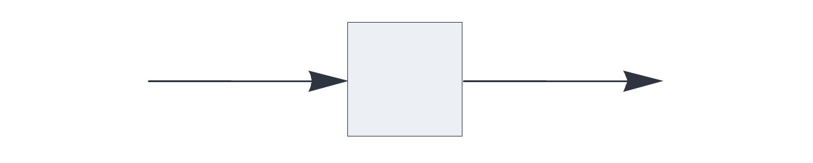
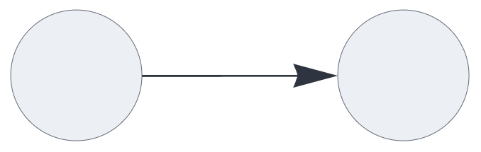
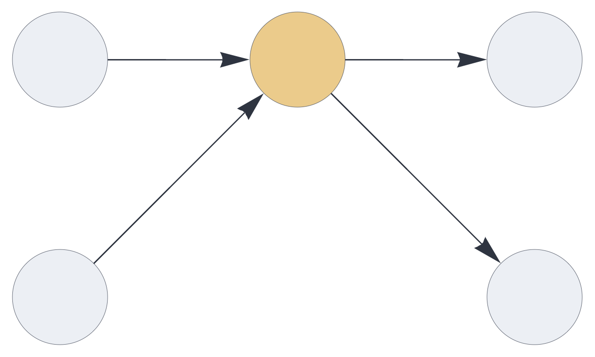
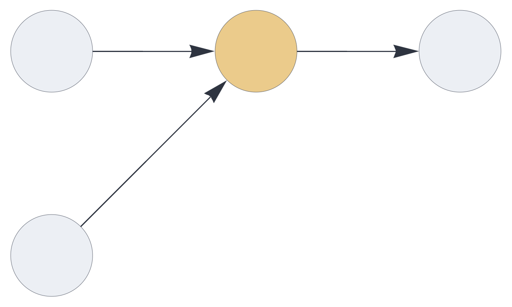
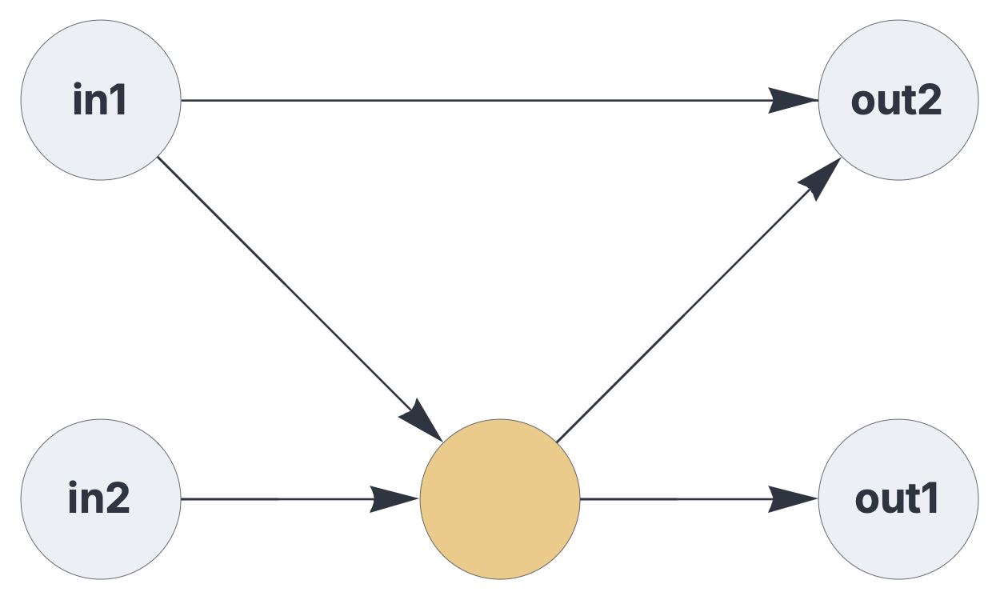
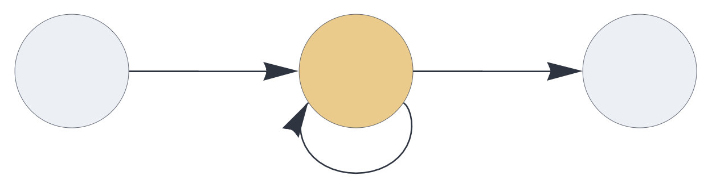
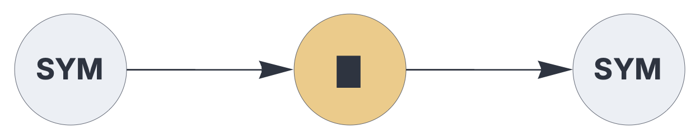
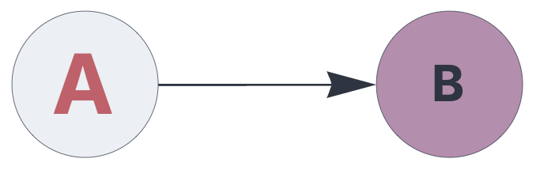

CIRCUIT CONFIGURATION


# Components

<br>


Components are the fundamental building blocks of circuits, representing stateful operations on sparse sets or multisets.

See also: https://creatingintelligence.org/#circuits


## List of all circuit components

| Component | Functionality |
|:---------------------|:----------------------------------------------------------------------|
| [`input`](input.md) & [`output`](output.md) | Gateway components that connect to the circuit's function interface, reducing multisets to sets by default while optionally loading encoder or decoder plugins.  |
| [`delay`](delay.md) & [`noise`](noise.md) | [`delay`](delay.md) defers incoming signals by one cycle and integrates them temporally based on update rules; [`noise`](noise.md) generates pseudo-random sparse sets without requiring input blocks.  |
| [`circuit`](circuit.md) | Embeds nested circuits locally via the `file` plugin or globally via the `shared` registry plugin.  |
| [`auto`](auto.md) | Auto-associative memory that incrementally learns at each cycle, applying update rules to manage how the retrieved pattern interacts with query pattern. |
| [`temporal`](temporal.md) | Temporal associative memory that maps temporal states to incoming inputs, automatically learning higher-order sequences on the fly when predictions fail.  |
| [`associator`](associator.md) | Hetero-associative memory for supervised learning that resolves multiset and inhibitory input, trains when the label input block is non-empty, and infers when the label block is empty.  |
| [`predictor`](predictor.md) | Hetero-associative memory for predictive learning that associates data from the previous cycle with the current label. |
| [`heteroencoder`](heteroencoder.md) | Hetero-associative memory for unsupervised learning that maps similar sets to stable SHRs on the fly, generating and learning new unique tokens for unknown inputs.  |


## Details and properties

- Data flow components, such as [`delay`](delay.md), control the temporal integration of data over multiple timesteps.
- Memory components, such as [`auto`](auto.md) or [`temporal`](temporal.md), encapsulate a topological associative memory instance.
- Excitatory signals are processed as positive integers, whereas inhibitory signals are processed as negative integers.
- Circuit components generally maintain a state across multiple execution cycles, whereas pathways are strictly stateless.
- The functionality of components can be extended via a standardized plugin mechanism.
- This framework supports the seamless integration of user-defined, custom components and plugins.
- Certain components may receive and send multiple signal partitions (block coding).
- Components are visualized as circles (data flow components) or squares (memory components)  in circuit schematics.


<br>

 
| Property    | Description |
|:------------|:----------------------------------------|
| `send`      |   output slots, as a list of integers |
| `receive`   |   list of input slots or tagged pathways |
| `plugin`	  |   extension module |  
| `label`     |   user-defined vertex label in circuit schematics | 
| `shape`	  |   vertex shape ("square", "circle", or "none")
| `fill`      |   background color (palette index 0 to 15)  | 
| `size`      |   font size, given in points |
| `color`     |   font color (palette index 0 to 15) |


## Sending and receiving data

A pathway is defined via a slot number that occurs in one component's `send`
parameters and in another (or the same) component's receive parameter. The choice
of slot numbers is arbitrary. The same slot can be received by multiple components (multi-casting). However, the same slot number must not occur
in multiple `send` parameters. 
 

```json
{ "hyperparameters": {"default": [1000, 10]},
  "dataflow": [
	{"component": "input", "send": [1]},
	{"component": "output", "receive": [1]}
  ]}
```

<br>


Lists of slot numbers denote disjoint blocks. Here the [`delay`](delay.md) component
receives and sends two disjoint set partitions:

```json
{ "hyperparameters": {"default": [1000, 10]},
  "dataflow": [
	{"component": "input", "send": [1]},
	{"component": "input", "send": [2]},
	{"component": "delay", "send": [11, 12], "receive": [1, 2]},
	{"component": "output", "receive": [11]},
	{"component": "output", "receive": [12]}
  ]}
```

<br>


`receive` parameters wrapped in a list denotes signal merging:

```json
{ "hyperparameters": {"default": [1000, 10]},
  "dataflow": [
	{"component": "input", "send": [1]},
	{"component": "input", "send": [2]},
	{"component": "delay", "send": [11], "receive": [[1, 2]]},
	{"component": "output", "receive": [11]}
  ]}
```

<br>

A circuit that combines pathway merging and block coding:

```json
{ "hyperparameters": {"default": [1000, 10]},
  "dataflow": [
	{"component": "input", "send": [1], "label": "in1"},
	{"component": "input", "send": [2], "label": "in2"},
	{"component": "delay", "send": [11, 12], "receive": [1, 2]},
	{"component": "output", "receive": [11], "label": "out1"},
	{"component": "output", "receive": [[12, 1]], "label": "out2"}
  ]}
```

<br>


A simple feedback system, routing the component's output slot directly back
into its input:

```json
{ "hyperparameters": {"default": [1000, 10]},
  "dataflow": [
	{"component": "input", "send": [1]},
	{"component": "delay", "send": [11], "receive": [[1,11]], "rate_limit": 1},
	{"component": "output", "receive": [11]}
  ]}
```
<br>


## Encoders, decoders, and update rules

Plugins extend the functionality of base circuit components while inheriting their properties and hyperparameters. 
Update rule plugins govern state updates in [`auto`](auto.md), [`delay`](delay.md), and [`temporal`](temporal.md) components to control temporal integration and associative behavior.
The [`input`](input.md) and [`output`](output.md) components can be extended with encoder and decoder plugins, respectively.


| Plugin Type | Implementations |
|:---------------------|:----------------------------------------------------------------------|
| Encoders & decoders | [`codec`](codec.md) maps symbolic tokens to random SHRs using a globally shared lexicon based on auto-associative pattern matching. [`category`](category.md) encodes integers 0 to K-1 as non-overlapping SHRs. [`binning`](binning.md) clusters similar SDRs into categorized bins based on matching thresholds.  |
| Vector encoders | [`vectorencoder`](vectorencoder.md) projects dense vectors into hyperdimensional space using sparse binary matrices and kWTA. [`flyhash`](flyhash.md) applies the classic flyhash algorithm to achieve similar SDR mapping for real-valued vectors. |
| Base update rules | [`replacement`](replacement.md) entirely substitutes the previous state with new data, bypassing capacity limits. [`augmentation`](augmentation.md) computes the multiset aggregation of signals, which converges incrementally to a stable state equivalent to a deduplicated set union. |
| Subtractive rules | [`residual`](residual.md) removes the retrieved pattern from the memory’s state to leave only novel elements for anomaly detection. [`difference`](difference.md) applies a symmetric multiset difference to enable generative retrieval behavior. [`complement`](complement.md) removes the current incoming signal from the state entirely. |
| Filtering & sequence rules | [`coincidence`](coincidence.md) retains only matching elements between query and retrieved patterns. [`permutation`](permutation.md) replaces the temporal state with its permutation before augmenting it with current signals, thereby preserving sequence order in temporal tracking. |


In the following example, the [`input`](input.md) component loads an encoder plugin,
the [`delay`](delay.md) component is extended via an update rule plugin, and the 
[`output`](output.md) component uses a decoder plugin.


```json
{ "hyperparameters": {"default": [1000, 10]},
  "dataflow": [
	{"component": "input", "plugin": "codec", "send": [1]},
	{"component": "delay", "plugin": "latch", "send": [11], 
		"receive": [1], "capacity": 1},
	{"component": "output", "plugin": "codec", "receive": [11]}
  ]}
```

<br>

As shown in the example above, plugins typically modify the visual appearance of components in circuit schematics.


## Component visualization

In circuit schematics, you can customize individual components'  `label`, `color`, `fill`, and `size` properties:


```json
{ "hyperparameters": {"default": [1000, 10]},
  "dataflow": [
	{"component": "input", "send": [1], 
		"label": "A", "color": 11, "size": 20},
	{"component": "output", "receive": [1], 
		"label": "B", "fill": 15, "size": 12}
  ]}
```

<br>


