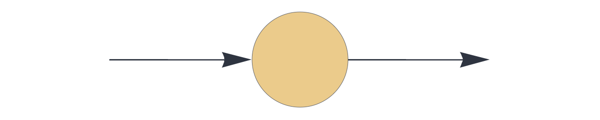
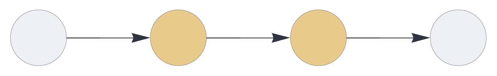
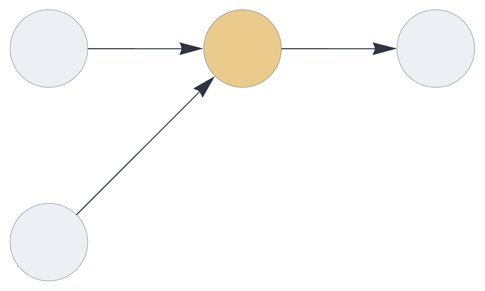
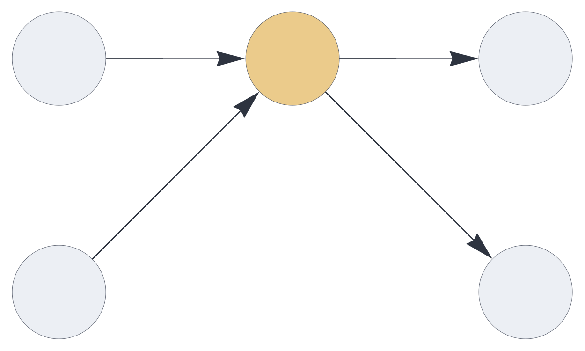
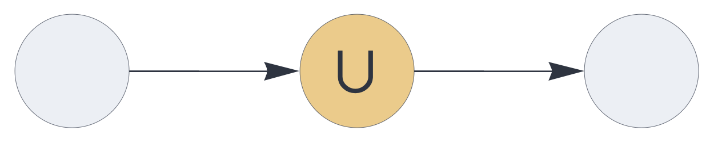
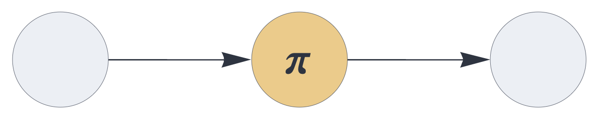

CIRCUIT COMPONENTS

# delay

<br>

Dataflow component, delaying incoming signals by one execution cycle and 
optionally integrating signals over multiple timesteps. 

## Details and properties

- By default, the `delay` component delays the inbound signal by one time step.
- Supports temporal integration of signals across evaluation cycles, governed by
 update rule plugins.
- Uses the same set of update rules for temporal integration as the [`temporal`](temporal.md) component.
- Is stateless by default (`replacement` update rule) and stateful with any other update rule.
- Controls sparsity through stochastic subsampling mechanisms.  
- Transparently handles multisets and inhibitory signals.
- Supports multiple input or output blocks.


<br>

 
| Property        | Default | Description |
|:------------|:-----:|:----------------------------------------|
| `send`        |  *required*    |  `[integer,...]` representing one or more output slots |
| `receive`     |  *required*    |  one or more input slots with pathway tags |
| `plugin`	    | `replacement` | update rule, governing the temporal integration logic |  
| `latch`	    | false | whether to skip the update if the input is empty |  
| `threshold`     | 0    |  clear input if relative population is below threshold |
| `rate_limit`    | infinite | subsample input if population exceeds the rate limit |    
| `decay`         | 0    | pre-integration decay (leak rate) |
| `capacity`      | 1    | relative population carried over from previous state (bypassed with default `replacement` plugin) |
| `decimate`      | 1    | proportional stochastic decimation |

<br>

Use standard [style options](components.md) to customize the component's appearance in circuit schematics.


## Stateless delay

The following circuit transports the signal, applying a proportional stochastic decimation by 80 percent. Note that this setup does not delay the signal flow because receiving data from inputs and sending data to outputs is instantaneous.

```json
{ "hyperparameters": {"default": [1000, 10]},
  "dataflow": [
	{"component": "input", "send": [1]},
	{"component": "delay", "send": [11], 
		"receive": [1], "decimate": 0.8},
	{"component": "output", "receive": [11]}
  ]}
```

<br>


## Delay chains


The following setup, chaining two `delay` nodes, delays the signal by one timestep:

```json
{ "hyperparameters": {"default": [1000, 10]},
  "dataflow": [
	{"component": "input", "send": [1]},
	{"component": "delay", "send": [11], "receive": [1]},
	{"component": "delay", "send": [21], "receive": [11]},
	{"component": "output", "receive": [21]}
  ]}
```

<br>


## Block coding

The `delay` component may receive or send multiple blocks of data. The total
input dimensions and output dimensions must be the same. 

Here the `delay` node transparently merges two blocks into a single block that has twice the dimension of the inputs:

```json
{ "hyperparameters": {"default": [1000, 10], "11": [2000, 20]},
  "dataflow": [
	{"component": "input", "send": [1]},
	{"component": "input", "send": [2]},
	{"component": "delay", "send": [11], "receive": [1, 2]},
	{"component": "output", "receive": [11]}
  ]}
```

<br>


In this circuit, two disjoint blocks flow through the `delay` node:

```json
{ "hyperparameters": {"default": [1000, 10]},
  "dataflow": [
	{"component": "input", "send": [1]},
	{"component": "input", "send": [2]},
	{"component": "delay", "send": [11, 12], "receive": [1, 2]},
	{"component": "output", "receive": [11]},
	{"component": "output", "receive": [12]}
  ]}
```

<br>


## Pathway merging

In the following circuit, the two incoming blocks of information are merged.
The output dimension is the same as either input dimension.
Note that the list notation in the `receive` specification denotes signal merging.

```json
{ "hyperparameters": {"default": [1000, 10]},
  "dataflow": [
	{"component": "input", "send": [1]},
	{"component": "input", "send": [2]},
	{"component": "delay", "send": [11], "receive": [[1, 2]], "decimate": 0.8},
	{"component": "output", "receive": [11]}
  ]}
```

<br>


## Temporal integration via augmentation


This circuit uses the [`augmentation`](augmentation.md) plugin, carrying over
twice the default population and applying a pre-integration stochastic decay of 15 percent.
The accumulated state does not retain the temporal order of signals.

```json
{ "hyperparameters": {"default": [1000, 10]},
  "dataflow": [
	{"component": "input", "send": [1]},
	{"component": "delay", "plugin": "augmentation", "send": [11], 
		"receive": [1], "capacity": 2, "decay": 0.15},
	{"component": "output", "receive": [11]}
  ]}
```
  
<br>
  

## Temporal sequence permutation

Using the [`permutation`](permutation.md) plugin as the update rule, a permutation
is applied to the previous state before integration with the current incoming signal.
The accumulated state retains information about the order within the temporal sequence.

```json
{ "hyperparameters": {"default": [1000, 10]},
  "dataflow": [
	{"component": "input", "send": [1]},
	{"component": "delay", "plugin": "permutation", "send": [11], 
		"receive": [1], "capacity": 5},
	{"component": "output", "receive": [11]}
  ]}
```  

<br>
