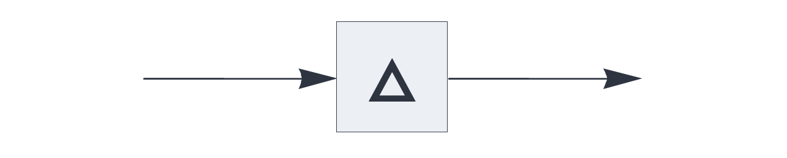
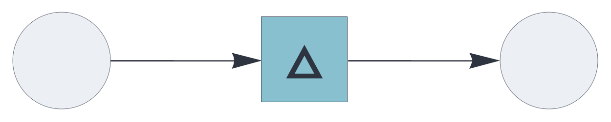
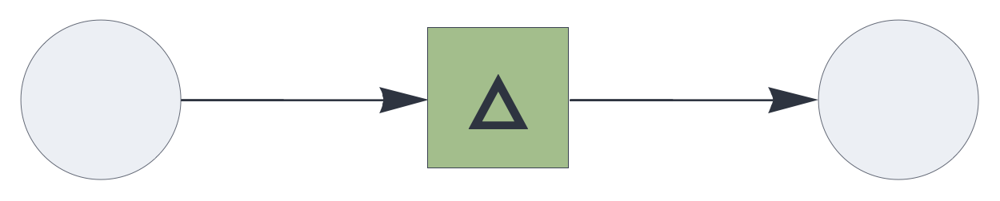

UPDATE RULE PLUGINS

# difference

<br>

Update rule plugin, augmenting a state with new elements while dropping
elements that are common to the state and the new information.

See also: https://creatingintelligence.org/#update-rules


## Details

- Plugin for [`auto`](auto.md), [`delay`](delay.md), and [`temporal`](temporal.md) components.
- Transparently handles multisets and inhibitory signals.
- Corresponds to the set symmetric difference after deduplication.


## Auto-associative memory with difference update

As a plugin for the [`auto`](auto.md) component, the `difference` update rule
replaces the memory's state with the symmetric difference between the query and the retrieved data, removing the matching elements.

This update rule enables generative behavior in auto-associative memory retrieval.


```json
{ "hyperparameters": {"default": [1000, 10]},
  "dataflow": [
	{"component": "input", "send": [1]},
	{"component": "auto", "plugin": "difference", 
		"send": [2], "receive": [1]},
	{"component": "output", "receive": [2]}
  ]}
```

<br>


See also: https://creatingintelligence.org/#auto-associative-memory


## Temporal associative memory with difference update

Used as a plugin for the [`temporal`](temporal.md) component, the `difference` 
update rule replaces the internal state with 
the symmetric multiset difference of the state and the incoming signal.


```json
{ "hyperparameters": {"default": [1000, 10]},
  "dataflow": [
	{"component": "input", "send": [1]},
	{"component": "temporal", "plugin": "difference", 
		"send": [11], "receive": [1]},
	{"component": "output", "receive": [11]}
  ]}
```

<br>


## Source code

*from circuits.py insert difference*


