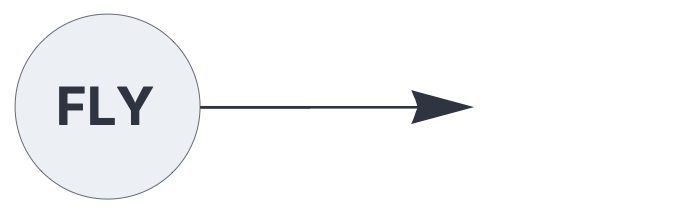
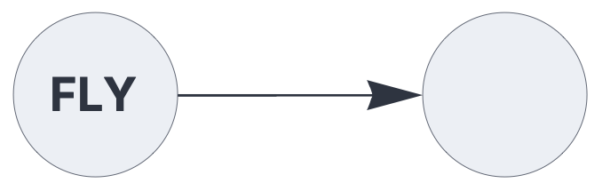

ENCODERS & DECODERS

# flyhash

<br>

Encodes dense vector data as Sparse Distributed Representations (SDRs)
using the classic flyhash algorithm.

See also: https://creatingintelligence.org/#sdr-encoders

## Details

- Encoder plugin for the [`input`](input.md) component.
- Encodes dense, real-valued vectors to SDRs.
- Maps similar vectors to similar SDRs.


## Flyhash encoding


The following circuit encodes dense vectors as SDRs:


```json
{ "hyperparameters": {"default": [1000, 10]},
  "dataflow": [
	{"component": "input", "plugin": "flyhash", "send": [1]},
	{"component": "output", "receive": [1]}
  ]}
```

<br>

