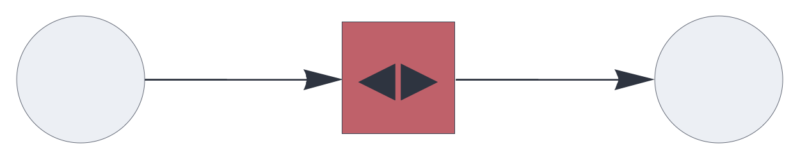

CIRCUIT COMPONENTS

# heteroencoder

<br>

Hetero-associative memory component for unsupervised learning.


See also: https://creatingintelligence.org/#heteroencoder


## Details and properties

- Encapsulates a hetero-associative topological memory instance.
- Maps similar sets (SDRs or SHRs) to stable symbolic tokens (SHRs) on the fly.
- Has no input for a teaching signal.
- Generates and learns a unique output SHR when encountering unknown input.
- May receive block-coded input.
- Resolves multiset and inibitory input prior to processing.


<br>

 
| Property        | Default | Description |
|:------------|:-----:|:----------------------------------------|
| `send`        |  *required*    |  integer, representing a single output slot |
| `receive`     |  *required*    |  one or several input slots with pathway tags |
| `threshold`     | *automatic*    |  relative pattern matching threshold  |

<br>

Use standard [style options](components.md) to customize the component's appearance in circuit schematics.


## Unsupervised learning


A simple hetero-encoding circuit:

```json
{ "hyperparameters": {"default": [1000, 10]},
  "dataflow": [
	{"component": "input", "send": [1]},
	{"component": "heteroencoder", "send": [11], "receive": [1]},
	{"component": "output", "receive": [11]}
  ]}
```

<br>

