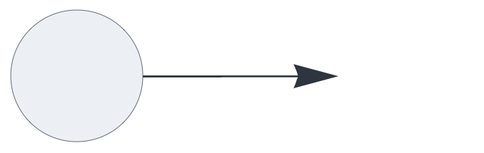
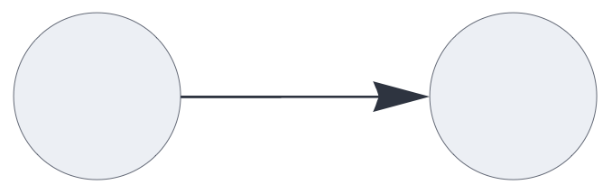
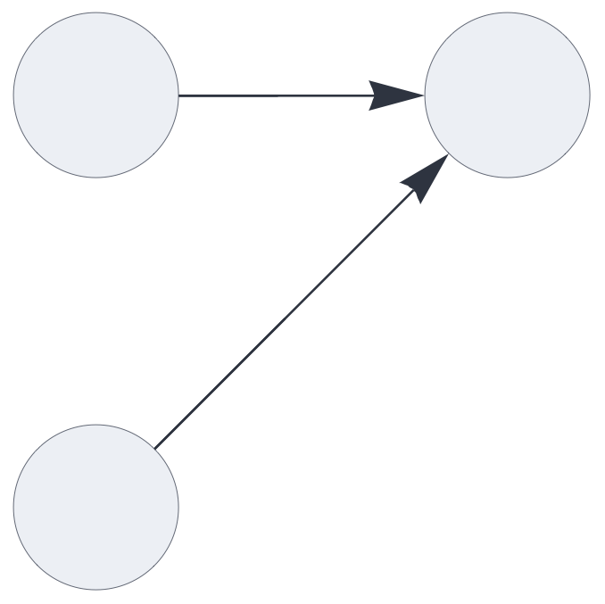
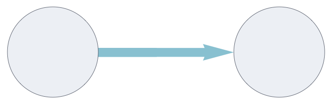
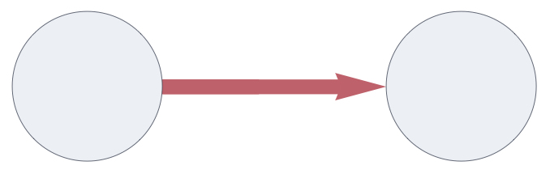

CIRCUIT COMPONENTS

# input

<br>

A gateway component that receives data from the circuit's function interface,
optionally encoding it through a plugin.


## Details and properties

- Circuits may have multiple [`input`](input.md) nodes, each representing one block of data.
- Supports encoder plugins, mapping external data representations to sets.
- Transparently handles multisets and inhibitory signals.
- Sends data downstream without delay. 


<br>

| Property        | Default | Description |
|:------------|:-----:|:----------------------------------------|
| `send`        | *required*     |  `[integer]` representing a single output slot  |
| `plugin`	    |      | encoder plugin  |  


Use standard [style options](components.md) to customize the component's appearance in circuit schematics.


## Basic input and output

This is the simplest possible circuit, routing signals directly from 
the `input` node to the [`output`](output.md) node.
Multiset or inhibitory inputs are reduced to sets along the pathway.

```json
{ "hyperparameters": {"default": [1000, 10]},
  "dataflow": [
	{"component": "input", "send": [1]},
	{"component": "output", "receive": [1]}
  ]}
```

<br>


## Multiple inputs

Each input node represents a disjoint partition (or block) of the overall input signal.

This merges the signals from two input nodes into a single output node. Note
that the list notation in the `receive` parameter denotes merging.


```json
{ "hyperparameters": {"default": [1000, 10]},
  "dataflow": [
	{"component": "input", "send": [1]},
	{"component": "input", "send": [2]},
	{"component": "output", "receive": [[1, 2]]}
  ]}
```

<br>


## Multisets

This circuit routes multisets from the input to the output.

```json
{ "hyperparameters": {"default": [1000, 10]},
  "dataflow": [
	{"component": "input", "send": [1]},
	{"component": "output", 
		"receive": [{"slot": 1, "tags": ["multiset"]}]}
  ]}
```

<br>


## Inhibitory multisets

The following circuit transports multiset data including inhibitory signals. Note that inhibitory pathways implicitly carry multisets.

```json
{ "hyperparameters": {"default": [1000, 10]},
  "dataflow": [
	{"component": "input", "send": [1]},
	{"component": "output", 
		"receive": [{"slot": 1, "tags": ["inhibit"]}]}
  ]}
```

<br>


## Encoding input data

The `input` component supports encoder plugins that convert external data
to sets. 

The following circuit uses the [`codec`](#codec.md) plugin which encodes symbolic tokens as random Sparse Holographic Representations (SHRs). Here, the [`output`](#output.md) component uses the
same plugin instance to decode the SHRs, exactly reversing the mapping.


```json
{ "hyperparameters": {"default": [1000, 10]},
  "dataflow": [
	{"component": "input", "plugin": "codec", "send": [1]},
	{"component": "output", "plugin": "codec", "receive": [1]}
  ]}
```

<br>


This uses the [`flyhash`](flyhash.md) encoder:

```json
{ "hyperparameters": {"default": [1000, 10]},
  "dataflow": [
	{"component": "input", "plugin": "flyhash", "send": [1]},
	{"component": "output", "receive": [1]}
  ]}
```
<br>


## Source code

*from circuits.py insert input*


