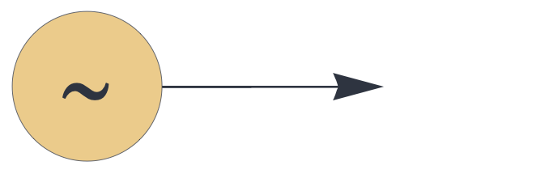
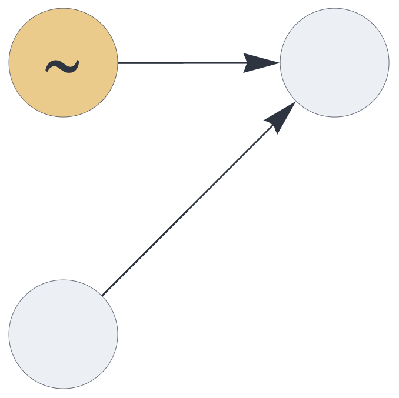
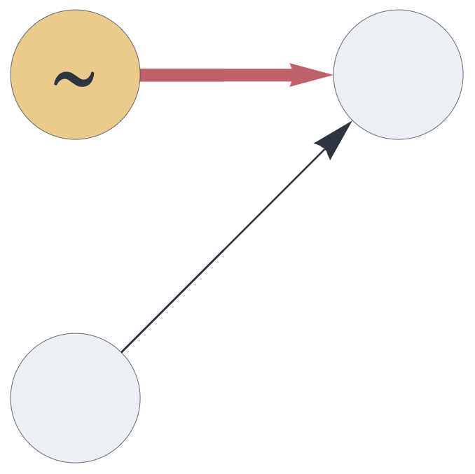

CIRCUIT COMPONENTS

# noise

<br>

A circuit component that generates pseudo-random sparse sets.

## Details and properties

- The `noise` component has no input and returns one output block.
- The dimension and population of the generated representations is governed by the outbound slot's hyperparameters.

<br>

| Property        | Default | Description |
|:------------|:-----:|:----------------------------------------|
| `send`        | *required*     |  a single output slot  |


Use standard [style options](components.md) to customize the component's appearance in circuit schematics.


## Additive noise

Add random noise to the input signal:


```json
{ "hyperparameters": {"default": [1000, 10]},
  "dataflow": [
	{"component": "input", "send": [1]},
	{"component": "noise", "send": [2]},
	{"component": "output", "receive": [[1, 2]]}
  ]}
```

<br>


## Subtractive noise

Use an inhibitory pathway to make the noise subtractive:


```json
{ "hyperparameters": {"default": [1000, 10]},
  "dataflow": [
	{"component": "input", "send": [1]},
	{"component": "noise", "send": [2]},
	{"component": "output", "receive": [[1, {"slot": 2, "tags": ["inhibit"]}]]}
  ]}
```

<br>


## Source code

*from circuits.py insert noise*


