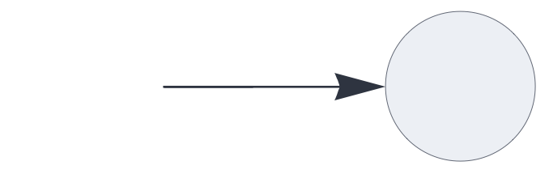
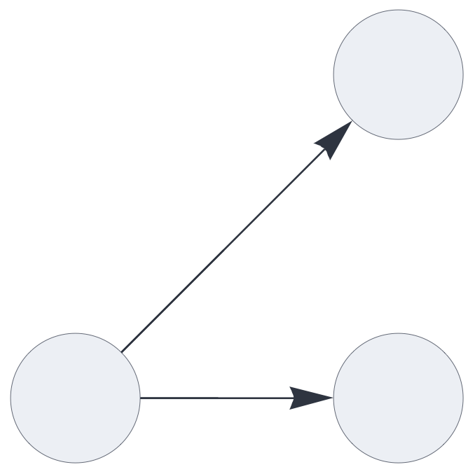

CIRCUIT COMPONENTS

# output

<br>

A gateway component that returns data to the circuit's function interface, optionally
decoding it through a plugin.

## Details and properties

- Circuits may have multiple [`output`](output.md) nodes, each representing one block of data.
- Supports decoder plugins, mapping sets to external data representations.
- Transparently handles multisets and inhibitory signals.
- Receives data from the upstream component without delay. 


<br>

| Property        | Default | Description |
|:------------|:-----:|:----------------------------------------|
| `receive`        | *required*     |  input slots with optional pathway tags  |
| `plugin`	    |      | decoder plugin  |  


Use standard [style options](components.md) to customize the component's appearance in circuit schematics.


## Basic input and output

This is the simplest possible circuit, routing signals directly from 
the [`input`](#input.md) node to the `output` node.
Multiset or inhibitory inputs are reduced to sets along the pathway.

```json
{ "hyperparameters": {"default": [1000, 10]},
  "dataflow": [
	{"component": "input", "send": [1]},
	{"component": "output", "receive": [1]}
  ]}
```

<br>


## Multiple outputs

Each output node represents a disjoint partition (or block) of the overall output signal.

The following circuit broadcasts the input signal to two outputs:


```json
{ "hyperparameters": {"default": [1000, 10]},
  "dataflow": [
	{"component": "input", "send": [1]},
	{"component": "output", "receive": [1]},
	{"component": "output", "receive": [1]}
  ]}
```

<br>


## Multisets

This circuit outputs a multiset:

```json
{ "hyperparameters": {"default": [1000, 10]},
  "dataflow": [
	{"component": "input", "send": [1]},
	{"component": "output", 
		"receive": [{"slot": 1, "tags": ["multiset"]}]}
  ]}
```

<br>


## Decoding output data

The `output` component supports decoder plugins that convert sets or multisets 
to external data representations.

The following circuit uses the [`codec`](#codec.md) plugin which encodes symbolic tokens as random Sparse Holographic Representations (SHRs). Here, the [`output`](#output.md) component uses the
same plugin instance to decode the SHRs, exactly reversing the mapping.


```json
{ "hyperparameters": {"default": [1000, 10]},
  "dataflow": [
	{"component": "input", "plugin": "codec", "send": [1]},
	{"component": "output", "plugin": "codec", "receive": [1]}
  ]}
```

<br>


