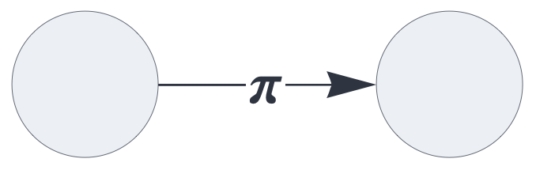
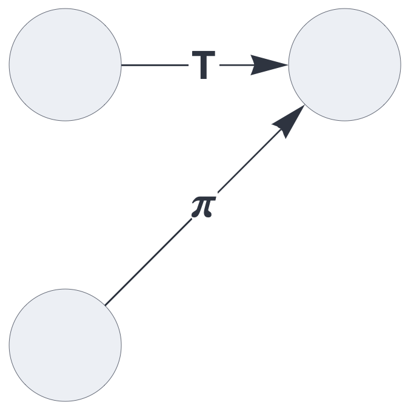
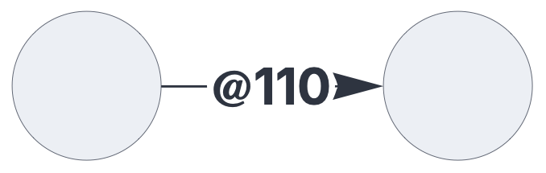
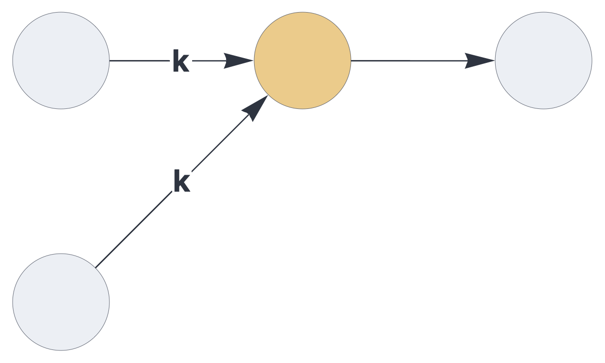
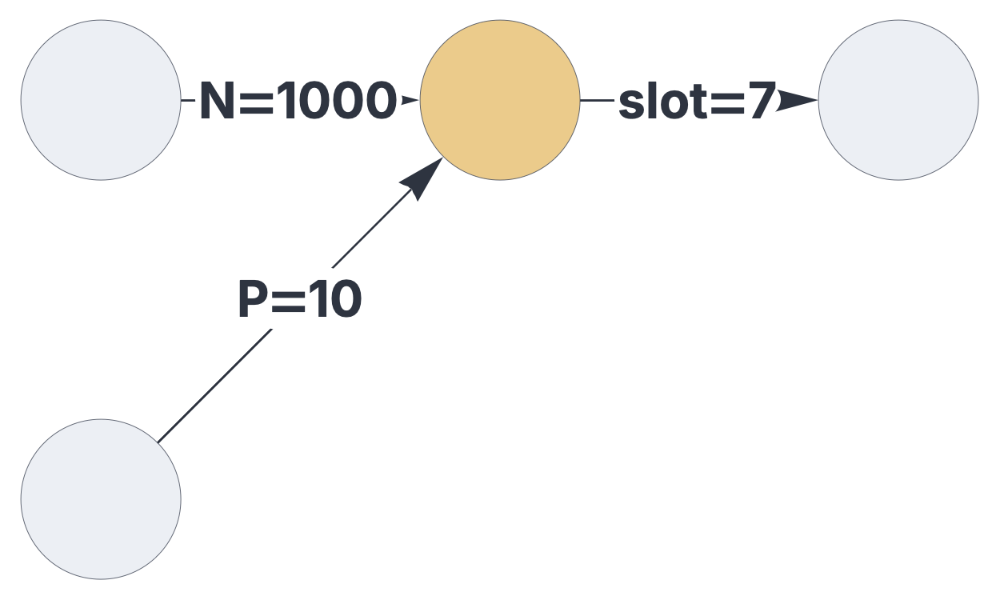
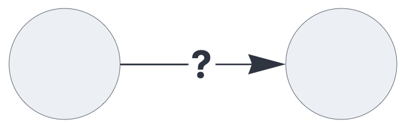

CIRCUIT CONFIGURATON


# Pathways

<br>


Pathways represent directed, stateless connections between circuit components,
transporting sparse sets or multisets.

See also: https://creatingintelligence.org/#circuits


## Details and properties

- Pathways are strictly stateless, whereas circuit components generally maintain a state across multiple execution cycles.
- The dataflow along pathways is clocked and globally synchronized.
- By default, a pathway transports sets, automatically removing duplicate and inhibitory elements.
- Pathways can be configured to transport multisets (duplicate elements) and inhibitory signals (negative elements).
- Pathways may be configured to modify their payload.
- Dataflow within a circuit can be controlled via pathway merging options.
- Within the dataflow description format, pathway properties are specified within the components' `receive` parameters.<br>


<br>

| Property    | Description |
|:------------|:----------------------------------------|
| `slot`	  |   integer slot number, linking to an upstream component |  
| `tags`      |   list of signal flow modifiers | 
| `gating`    |   temporal multiplexing, specified by a list of 0s and 1s |


## Pathway tagging


A regular pathway:

```json
{ "hyperparameters": {"default": [1000, 10]},
  "dataflow": [
	{"component": "input", "send": [1]},
	{"component": "output", "receive": [1]}
  ]}
```

<br>


The same network with a tagged pathway:

```json
{ "hyperparameters": {"default": [1000, 10]},
  "dataflow": [
	{"component": "input", "send": [1]},
	{"component": "output", "receive": [{"slot": 1, "tags": ["permute"]}]}
  ]}
```

<br>


This setup merges two pathways, each individually tagged:

```json
{ "hyperparameters": {"default": [1000, 10]},
  "dataflow": [
	{"component": "input", "send": [1]},
	{"component": "input", "send": [2]},
	{"component": "output", 
		"receive": [[{"slot": 1, "tags": ["permute"]}, 
					 {"slot": 2, "tags": ["threshold"]}]]}
  ]}
```


<br>


## Gated pathways

The `gating` property opens and closes the pathway at specific time
intervals. In the following example, the pathway transports data for two
cycles, then blocks for one cycle. All repeating gating patterns are aligned to 
start simultaneously with the global clock.


```json
{ "hyperparameters": {"default": [1000, 10]},
  "dataflow": [
	{"component": "input", "send": [1]},
	{"component": "output", "receive": [{"slot": 1, "gating": [1, 1, 0]}]}
  ]}
```

<br>


## Signal modifications

| Tag   | Display | Description |
|:------------|:-----:|:----------------------------------------|
| `multiset` | blue arrow    |  enable multiset signals |
| `inhibit` | red arrow    |  enable inhibitory multiset signals |
| `permute` | π   |  applies a permutation unique to the path|
| `rate_limit` | R   |  limits the population to the path's default population |
| `threshold` | T   |  clears signals below default population |
| `noise` | ~   |  generates random noise if signal is non-empty, else clears the path |


This pathway conveys multisets:

```json
{ "hyperparameters": {"default": [1000, 10]},
  "dataflow": [
	{"component": "input", "send": [1]},
	{"component": "output", "receive": [{"slot": 1, "tags": ["multiset"]}]}
  ]}
```


<br>

Inhibitory pathways transport multisets, flipping all positive elements to negative elements. Within this framework, this mechanism is the exclusive source of inhibitory signals apart from external input.


```json
{ "hyperparameters": {"default": [1000, 10]},
  "dataflow": [
	{"component": "input", "send": [1]},
	{"component": "output", "receive": [{"slot": 1, "tags": ["inhibit"]}]}
  ]}
```

<br>


## Pathway merging and signal flow control


| Tag   | Display | Description |
|:------------|:-----:|:----------------------------------------|
| `veto` |  X    |  clears all paths if any X path is non-empty | 
| `mandatory` |  *   |  clears all paths if any * path is empty | 
| `priority` |  !   |  clears all non-! paths if any ! path is non-empty |
| `dependency` |  &    |  clears & paths if any non-& path is empty (AND) |
| `fallback` | &#124;   |  clears &#124; paths if any non-&#124; path is non-empty (NOR) |
| `barrier` | =  |  clears = paths if any = path is empty |
| `kwta_excitatory` | K  |  top-K excitatory (positive) signals |
| `kwta_absolute` | k   |  top-k signals (total saliency) |


In this circuit, to paths are merged via kWTA:

```json
{ "hyperparameters": {"default": [1000, 10]},
  "dataflow": [
	{"component": "input", "send": [1]},
	{"component": "input", "send": [2]},
	{"component": "delay", "send": [11], 
		"receive": [[{"slot": 1, "tags": ["kwta_absolute"]}, 
					 {"slot": 2, "tags": ["kwta_absolute"]}]]},
	{"component": "output", "receive": [11]}
  ]}
```

<br>


## Schematics rendering and data logging

| Tag   | Display | Description |
|:------------|:-----:|:----------------------------------------|
| `label` |  *string*    |  custom edge label | 
| `show_slot` |  *integer*    |  render the path's slot number | 
| `show_dimension` |  *N*   |  render the path's dimension hyperparameter | 
| `show_population` |  *P*   |  render the path's population hyperparameter |
| `log` |  ?    |  print the path's payload to the console at every timestep |


Customize edge labels:

```json
{ "hyperparameters": {"default": [1000, 10]},
  "dataflow": [
	{"component": "input", "send": [1]},
	{"component": "input", "send": [2]},
	{"component": "delay", "send": [7], "receive": 
		[[{"slot": 1, "label": "P=", "tags": ["show_population"]}, 
		  {"slot": 2, "label": "N=", "tags": ["show_dimension"]}]]},
	{"component": "output", "receive": 
		 [{"slot": 7, "label": "slot=", "tags": ["show_slot"]}]}
  ]}
```

<br>

Tagging a pathway with `log` prints its payload to the console
at every evaluation cycle.


```json
{ "hyperparameters": {"default": [1000, 10]},
  "dataflow": [
	{"component": "input", "send": [1]},
	{"component": "output", "receive": [{"slot": 1, "tags": ["log"]}]}
  ]}
```
<br>


<br>

