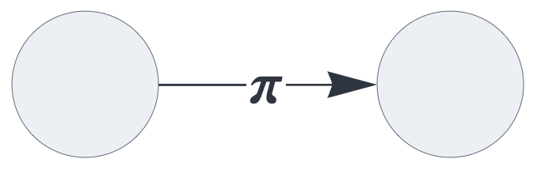
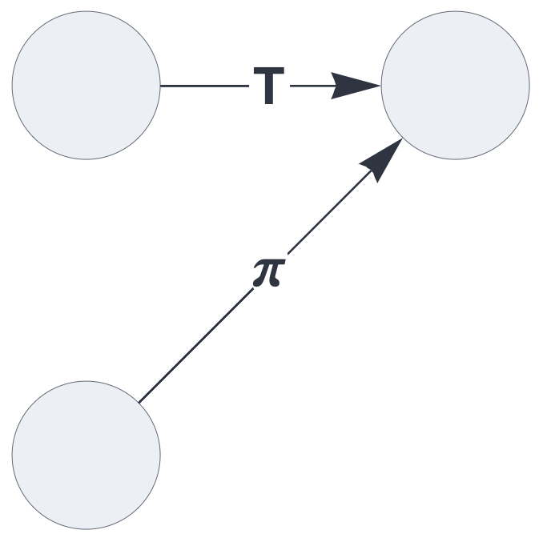
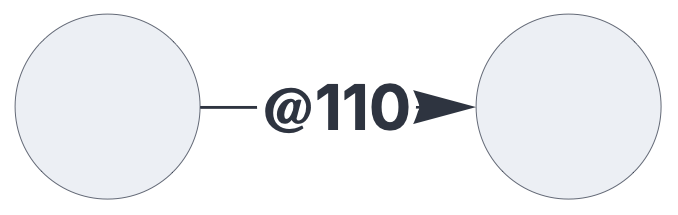
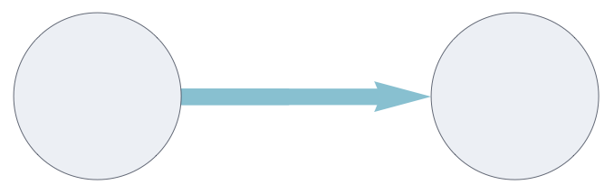
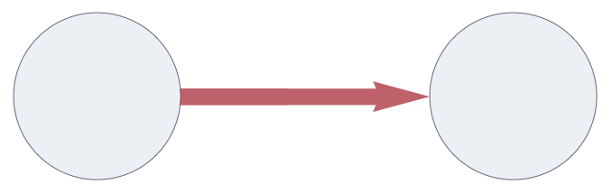
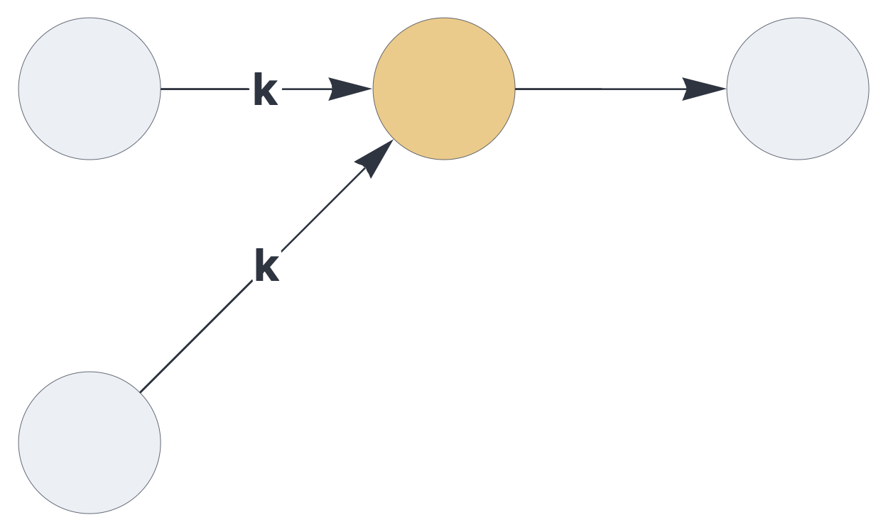
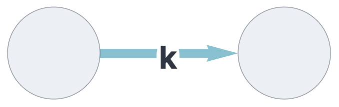
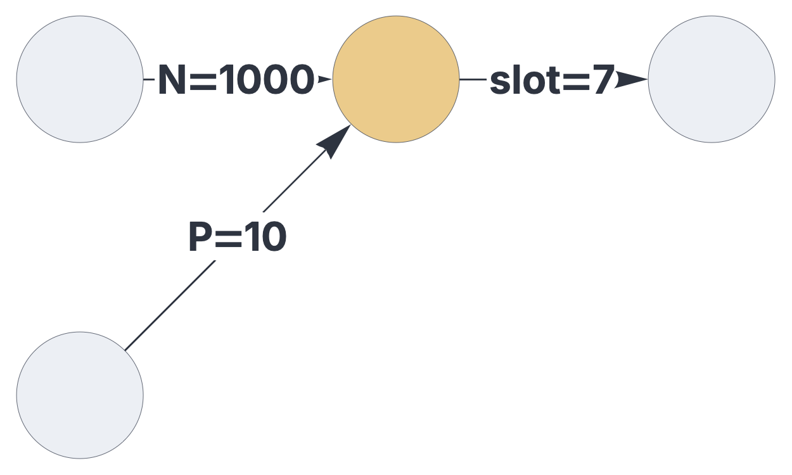
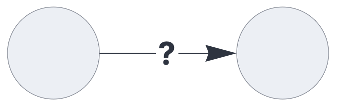

CIRCUIT CONFIGURATION


# Pathways

<br>


Pathways represent directed, stateless connections between circuit components,
transporting sparse sets or multisets.

See also: https://creatingintelligence.org/#circuits


## Details and properties

- Pathways are strictly stateless, whereas circuit components generally maintain a state across multiple execution cycles.
- The dataflow along pathways is clocked and globally synchronized.
- By default, a pathway transports sets, automatically removing duplicate and inhibitory elements.
- Pathways can be configured to transport multisets (duplicate elements) and inhibitory signals (negative elements).
- Pathways may be configured to modify their payload.
- Dataflow within a circuit can be controlled via pathway merging options.
- Within the dataflow description format, pathway properties are specified within the components' `receive` parameters.<br>


<br>

| Property    | Description |
|:------------|:----------------------------------------|
| `slot`	  |   integer slot number, linking to an upstream component |  
| `tags`      |   list of signal flow modifiers | 
| `gating`    |  implements  temporal multiplexing, specified by a recurring array of 0s and 1s, to close or open paths at specific intervals aligned with the global clock  |


## Pathway tagging


A regular pathway:

```json
{ "hyperparameters": {"default": [1000, 10]},
  "dataflow": [
	{"component": "input", "send": [1]},
	{"component": "output", "receive": [1]}
  ]}
```

<br>


The same network with a tagged pathway:

```json
{ "hyperparameters": {"default": [1000, 10]},
  "dataflow": [
	{"component": "input", "send": [1]},
	{"component": "output", "receive": [{"slot": 1, "tags": ["permute"]}]}
  ]}
```

<br>


This setup merges two pathways, each individually tagged:

```json
{ "hyperparameters": {"default": [1000, 10]},
  "dataflow": [
	{"component": "input", "send": [1]},
	{"component": "input", "send": [2]},
	{"component": "output", 
		"receive": [[{"slot": 1, "tags": ["permute"]}, 
					 {"slot": 2, "tags": ["threshold"]}]]}
  ]}
```


<br>


## Gated pathways

The `gating` property opens and closes the pathway at specific time
intervals. In the following example, the pathway transports data for two
cycles, then blocks for one cycle. All repeating gating patterns are aligned to 
start simultaneously with the global clock.


```json
{ "hyperparameters": {"default": [1000, 10]},
  "dataflow": [
	{"component": "input", "send": [1]},
	{"component": "output", "receive": [{"slot": 1, "gating": [1, 1, 0]}]}
  ]}
```

<br>


## Signal modifications

| Tag   | Display | Description |
|:------------|:-----:|:----------------------------------------|
| `multiset` | blue arrow    |  enables multiset signals |
| `inhibit` | red arrow    | enables multiset signals, flips positive elements to negative (inhibitory) elements |
| `permute` | π   |  applies a permutation unique to the specified path |
| `rate_limit` | R   |  caps the population at the path's default population |
| `threshold` | T   |  clears signals that fall below the path's default population |
| `noise` | ~   |  generates random noise if signal is empty, otherwise clearing the path |


This pathway conveys multisets:

```json
{ "hyperparameters": {"default": [1000, 10]},
  "dataflow": [
	{"component": "input", "send": [1]},
	{"component": "output", "receive": [{"slot": 1, "tags": ["multiset"]}]}
  ]}
```


<br>

Inhibitory pathways transport multisets, flipping all positive elements to negative elements. Within this framework, this mechanism is the exclusive source of inhibitory signals apart from external input.


```json
{ "hyperparameters": {"default": [1000, 10]},
  "dataflow": [
	{"component": "input", "send": [1]},
	{"component": "output", "receive": [{"slot": 1, "tags": ["inhibit"]}]}
  ]}
```

<br>


## Pathway merging and signal flow control


| Tag   | Display | Description |
|:------------|:-----:|:----------------------------------------|
| `veto` |  X    |  clears all paths if a veto path is non-empty | 
| `mandatory` |  *   |  clears all paths if a mandatory path is empty | 
| `priority` |  !   |  clears all non-priority paths if a priority path is non-empty |
| `dependency` |  &    |  clears dependency paths if any non-dependency path is empty (AND) |
| `fallback` | &#124;   |  clears fallback paths if any non-fallback path is non-empty (NOR) |
| `barrier` | =  |  clears barrier paths if any barrier path is empty |
| `kwta_excitatory` | K  |  passes the top-k excitatory elements ranked by multiplicity, ties included, with k taken to be the default population |
| `kwta_absolute` | k   |  passes the top-k elements ranked by total saliency (multiplicity of excitatory and inhibitory elements), ties included, with k taken to be the default population |


kWTA operates on the merged signal and also applies to a single path. If any
path of a merge carries a kWTA tag, the whole merge is filtered. Each element
is scored by its multiplicity summed over all merged paths: a set path
contributes one count per element, a multiset path contributes its duplicate
counts. All elements scoring at or above the k-th highest score pass, so ties
at the threshold are included; with k or fewer distinct elements, all pass.
k is the smallest default population among the merged paths. The output is a
set: `kwta_excitatory` ignores inhibitory elements, while `kwta_absolute` may
pass inhibitory winners as negative elements. kWTA applies no minimum score:
a flat input passes unchanged. Thresholding or rate limiting the result is
left to a downstream path or component.


In this circuit, two paths are merged via kWTA. Elements present on both
paths win; if the paths share no elements, their union passes.

```json
{ "hyperparameters": {"default": [1000, 10]},
  "dataflow": [
	{"component": "input", "send": [1]},
	{"component": "input", "send": [2]},
	{"component": "delay", "send": [11], 
		"receive": [[{"slot": 1, "tags": ["kwta_absolute"]}, 
					 {"slot": 2, "tags": ["kwta_absolute"]}]]},
	{"component": "output", "receive": [11]}
  ]}
```

<br>


kWTA on a single multiset path selects the most frequent elements:

```json
{ "hyperparameters": {"default": [1000, 10]},
  "dataflow": [
	{"component": "input", "send": [1]},
	{"component": "output", 
		"receive": [{"slot": 1, "tags": ["multiset", "kwta_absolute"]}]}
  ]}
```

<br>


## Schematics rendering and data logging

| Tag   | Display | Description |
|:------------|:-----:|:----------------------------------------|
| `label` |  *string*    |  custom edge label | 
| `show_slot` |  *integer*    |  render the path's slot number | 
| `show_dimension` |  *N*   |  render the path's dimension hyperparameter | 
| `show_population` |  *P*   |  render the path's population hyperparameter |
| `log` |  ?    |  print the path's payload to the console at every timestep |


Customize edge labels:

```json
{ "hyperparameters": {"default": [1000, 10]},
  "dataflow": [
	{"component": "input", "send": [1]},
	{"component": "input", "send": [2]},
	{"component": "delay", "send": [7], "receive": 
		[[{"slot": 1, "label": "P=", "tags": ["show_population"]}, 
		  {"slot": 2, "label": "N=", "tags": ["show_dimension"]}]]},
	{"component": "output", "receive": 
		 [{"slot": 7, "label": "slot=", "tags": ["show_slot"]}]}
  ]}
```

<br>

Tagging a pathway with `log` prints its payload to the console
at every evaluation cycle.


```json
{ "hyperparameters": {"default": [1000, 10]},
  "dataflow": [
	{"component": "input", "send": [1]},
	{"component": "output", "receive": [{"slot": 1, "tags": ["log"]}]}
  ]}
```

<br>


<br>

