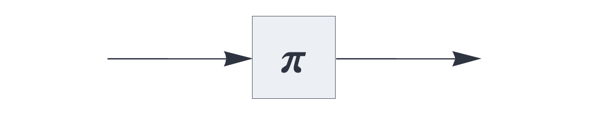

UPDATE RULE PLUGINS

# permutation

<br>

Update rule plugin, replacing the state with its permutation, augmented by the current signal.

See also: https://creatingintelligence.org/#permutation


## Details

- Plugin for [`delay`](delay.md) and [`temporal`](temporal.md) components.
- Not applicable with auto-associative memory ([`auto`](auto.md)).
- Transparently handles multiset and inhibitory signals.
- Repeated permutation of the temporal state encodes temporal sequences.


## Delay component with temporal sequence permutation


The [`delay`](delay.md) component applying the `permutation` update rule:


```
{ "hyperparameters": {"default": [1000, 10]},
  "dataflow": [
	{"component": "input", "send": [1]},
	{"component": "delay", "plugin": "augmentation", 
		"send": [11], "receive": [1], "capacity": 2, "decay": 0.15},
	{"component": "output", "receive": [11]}
  ]}
```

<br>


## Temporal associative memory with state permutation

Used as a plugin for the [`temporal`](temporal.md) component, `permutation` 
aggregates a state that preservers the order of prior inputs.


```json
{ "hyperparameters": {"default": [1000, 10]},
  "dataflow": [
	{"component": "input", "send": [1]},
	{"component": "temporal", "plugin": "permutation", 
		"send": [11], "receive": [1], "capacity": 2},
	{"component": "output", "receive": [11]}
  ]}
```

<br>


## Source code

*from circuits.py insert permutation*


