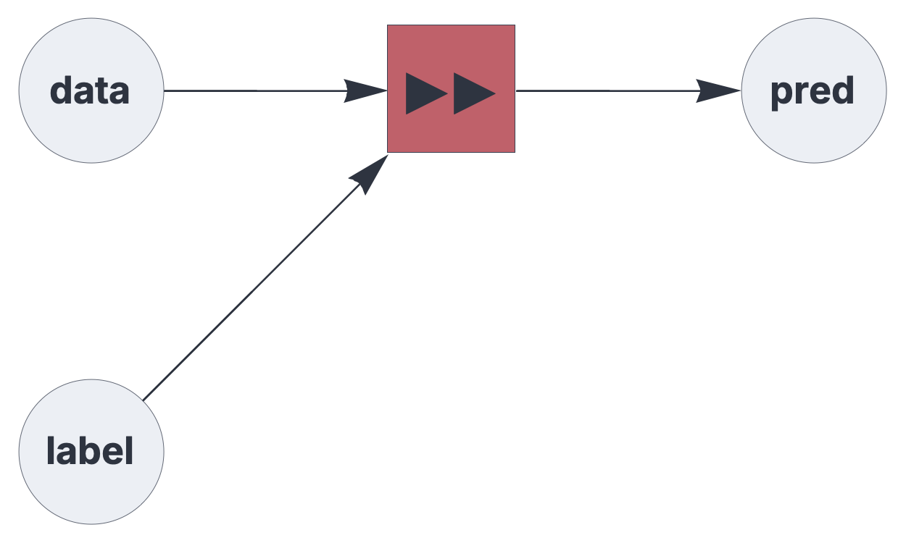

CIRCUIT COMPONENTS

# predictor

<br>

Hetero-associative memory component for predictive learning.

See also: https://creatingintelligence.org/#predictive-learning


## Details and properties

- Wrapper for a hetero-associative topological memory instance.
- Associates the data from the previous execution cycle with the current label signal.
- Typically used as readout node in reservoir architectures.
- Receives the label from its first `receive` block and data from the remaining blocks.
- Learns if the prediction does not match the subsequent input.
- A closed feedback loop enables generative prediction. 
- Sends the inferred label.
- Resolves multiset and inibitory input prior to processing.


<br>

 
| Property        | Default | Description |
|:------------|:-----:|:----------------------------------------|
| `send`        |  *required*    |  integer, representing a single output slot |
| `receive`     |  *required*    |  two or more input slots with pathway tags |
| `threshold`     | *automatic*    |  relative pattern matching threshold  |

<br>

Use standard [style options](components.md) to customize the component's appearance in circuit schematics.


## Predictive learning


A basic setup for predictive learning with hetero-associative memory:

```json
{ "hyperparameters": {"default": [1000, 10]},
  "dataflow": [
	{"component": "input", "send": [1], "label": "label"},
	{"component": "input", "send": [2], "label": "data"},
	{"component": "predictor", "send": [11], "receive": [1, 2]},
	{"component": "output", "receive": [11], "label": "pred"}
  ]}
```

<br>

