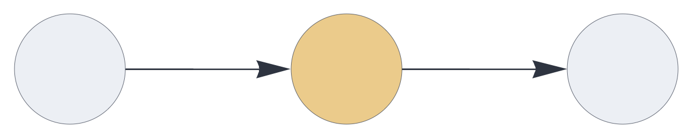
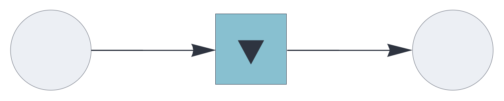
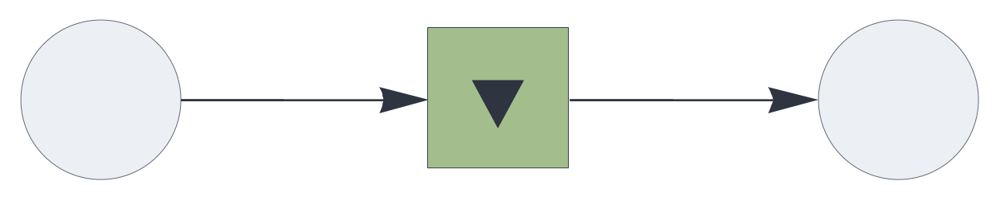

UPDATE RULE PLUGINS

# replacement

<br>

Update rule plugin, entirely replacing the previous state with new information.

See also: https://creatingintelligence.org/#update-rules


## Details

- Default plugin for [`auto`](auto.md), [`delay`](delay.md), and [`temporal`](temporal.md) components.
- Bypasses the component's `capacity` setting.
- Transparently handles multisets and inhibitory signals.


## Stateless delay

The `replacement` update mechanism is the default behavior of the [`delay`](delay.md)
component.

```json
{ "hyperparameters": {"default": [1000, 10]},
  "dataflow": [
	{"component": "input", "send": [1]},
	{"component": "delay", "send": [11], "receive": [1]},
	{"component": "output", "receive": [11]}
  ]}
```

<br>


## Auto-associative memory with replacement update

As the default update rule for the [`auto`](auto.md) component, `replacement` 
substitutes the memory's state with the retrieved value.

This is the classic auto-associative setup, most useful for pattern completion, denoising, and item stores. With this configuration, the auto-associative memory converges to a stable state. Stability is normally reached with just a single cycle because denoising iterations are already encapsulated within the memory retrieval algorithm.


```json
{ "hyperparameters": {"default": [1000, 10]},
  "dataflow": [
	{"component": "input", "send": [1]},
	{"component": "auto", "send": [2], "receive": [1]},
	{"component": "output", "receive": [2]}
  ]}
```

<br>


See also: https://creatingintelligence.org/#auto-associative-memory


## Temporal associative memory with replacement update

The [`temporal`](temporal.md) component applies the `replacement` update rule by default.
At every execution cycle, it replaces the internal state with the current input,
bypassing the `capacity` setting. This mechanism directly associates
each signal to the subsequent signal.


```json
{ "hyperparameters": {"default": [1000, 10]},
  "dataflow": [
	{"component": "input", "send": [1]},
	{"component": "temporal", "send": [11], "receive": [1]},
	{"component": "output", "receive": [11]}
  ]}
```

<br>

