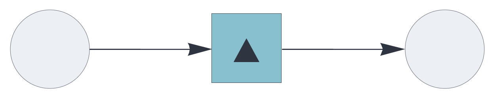

UPDATE RULE PLUGINS

# residual

<br>

Update rule plugin for auto-associative memory, removing the retrieved pattern from the memory’s state, leaving only the novel elements.

See also: https://creatingintelligence.org/#update-rules


## Details

- Plugin for the [`auto`](auto.md) component.
- Not applicable for temporal integration ([`delay`](delay.md) and  	[`temporal`](temporal.md)).
- Transparently handles multisets and inhibitory signals.
- Corresponds to the set complement after deduplication.


## Auto-associative memory with residual update

As a plugin for the [`auto`](auto.md) component, the `residual` update rule
removes the retrieved pattern from the query, leaving only the novel elements.
This mechanism is the basis for associative novelty detection.


```json
{ "hyperparameters": {"default": [1000, 10]},
  "dataflow": [
	{"component": "input", "send": [1]},
	{"component": "auto", "plugin": "residual", "send": [2], "receive": [1]},
	{"component": "output", "receive": [2]}
  ]}
```

<br>


See also: https://creatingintelligence.org/#auto-associative-memory

