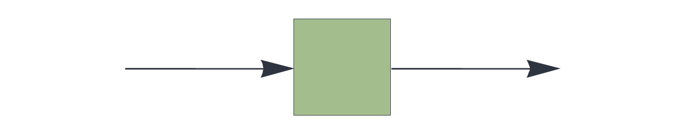
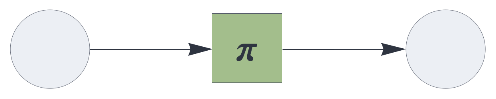

CIRCUIT COMPONENTS

# temporal

<br>

Temporal associative memory component.


## Details and properties

- Learns the association of the temporal state with the current input.
- Automatically learns if the previous prediction was incorrect.
- A closed feedback loop enables generative behavior.
- Predicts the next input based on the state.
- Supports temporal integration of signals across evaluation cycles, governed by
 update rule plugins.
- Uses update rule plugins to control the mechanics of state updates.
- Supports the same set of update rules for temporal integration as the [`delay`](delay.md) component.
- Controls sparsity through stochastic subsampling mechanisms.  
- Supports multiple input or output blocks.


<br>

 
| Property        | Default | Description |
|:------------|:-----:|:----------------------------------------|
| `send`        |  *required*    |  `[integer,...]` representing one or more output slots |
| `receive`     |  *required*    |  one or more input slots with pathway tags |
| `plugin`	    | `replacement` | update rule, governing the temporal integration logic |  
| `latch`	    | false | whether to skip the update if the input is empty |  
| `threshold`     | 0    |  clear input if relative population is below threshold |
| `rate_limit`    | infinite | subsample input if population exceeds the rate limit |    
| `decay`         | 0    | pre-integration decay (leak rate) |
| `capacity`      | 1    | relative population carried over from previous state (bypassed with default `replacement` plugin) |
| `decimate`      | 1    | proportional stochastic decimation |

<br>

Use standard [style options](components.md) to customize the component's appearance in circuit schematics.


## Temporal associative memory with replacement update

The [`temporal`](temporal.md) component applies the `replacement` update rule by default.
At every execution cycle, it replaces the internal state with the current input,
bypassing the `capacity` setting. This mechanism directly associates
each signal to the subsequent signal.


```json
{ "hyperparameters": {"default": [1000, 10]},
  "dataflow": [
	{"component": "input", "send": [1]},
	{"component": "temporal", "send": [11], "receive": [1]},
	{"component": "output", "receive": [11]}
  ]}
```

<br>


## Temporal associative memory with difference update

Used as a plugin for the [`temporal`](temporal.md) component, the `difference` 
update rule replaces the internal state with 
the symmetric multiset difference of the state and the incoming signal.


```json
{ "hyperparameters": {"default": [1000, 10]},
  "dataflow": [
	{"component": "input", "send": [1]},
	{"component": "temporal", "plugin": "difference", 
		"send": [11], "receive": [1]},
	{"component": "output", "receive": [11]}
  ]}
```

<br>

## Temporal associative memory with complement plugin

```json
{ "hyperparameters": {"default": [1000, 10]},
  "dataflow": [
	{"component": "input", "send": [1]},
	{"component": "temporal", "plugin": "complement", 
		"send": [11], "receive": [1], "capacity": 2},
	{"component": "output", "receive": [11]}
  ]}
```

<br>


## Temporal associative memory with state augmentation

Used as a plugin for the [`temporal`](temporal.md) component, `augmentation` 
aggregates an orderless state representing prior inputs.


```json
{ "hyperparameters": {"default": [1000, 10]},
  "dataflow": [
	{"component": "input", "send": [1]},
	{"component": "temporal", "plugin": "augmentation", 
		"send": [11], "receive": [1], "capacity": 5},
	{"component": "output", "receive": [11]}
  ]}
```

<br>


## Temporal associative memory with state permutation

Used as a plugin for the [`temporal`](temporal.md) component, `permutation` 
aggregates a state that preservers the order of prior inputs.


```json
{ "hyperparameters": {"default": [1000, 10]},
  "dataflow": [
	{"component": "input", "send": [1]},
	{"component": "temporal", "plugin": "permutation", 
		"send": [11], "receive": [1], "capacity": 2},
	{"component": "output", "receive": [11]}
  ]}
```

<br>


## Source code

*from circuits.py insert temporal*


