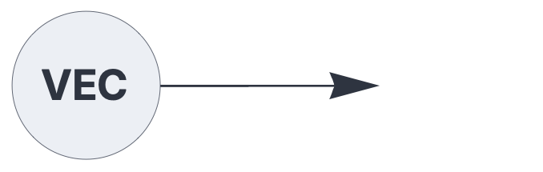
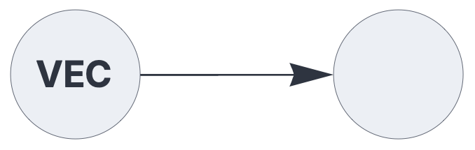

ENCODERS & DECODERS

# vectorencoder

<br>

Encodes dense vector data as Sparse Distributed Representations (SDRs).

See also: https://creatingintelligence.org/#sdr-encoders

## Details and properties

- Encoder plugin for the [`input`](input.md) component.
- Encodes dense, real-valued vectors to SDRs.
- Maps similar vectors to similar SDRs.
- Projects vectors into the hyperdimensional space given by hyperparameters [N, P]
through multiplication with a sparse binary matrix followed by kWTA.

<br>

| Property        | Default | Description |
|:------------|:-----:|:----------------------------------------|
| `sparsity`   | 1/sqrt(D) |  projection matrix sparsity (D is the input dimension)  |


## Vector-to-SDR encoding

The following circuit encodes dense vectors as SDRs.


```json
{ "hyperparameters": {"default": [1000, 10]},
  "dataflow": [
	{"component": "input", "plugin": "vectorencoder", "send": [1]},
	{"component": "output", "receive": [1]}
  ]}
```

<br>

